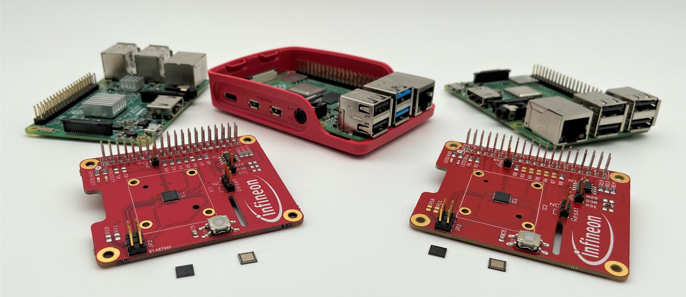
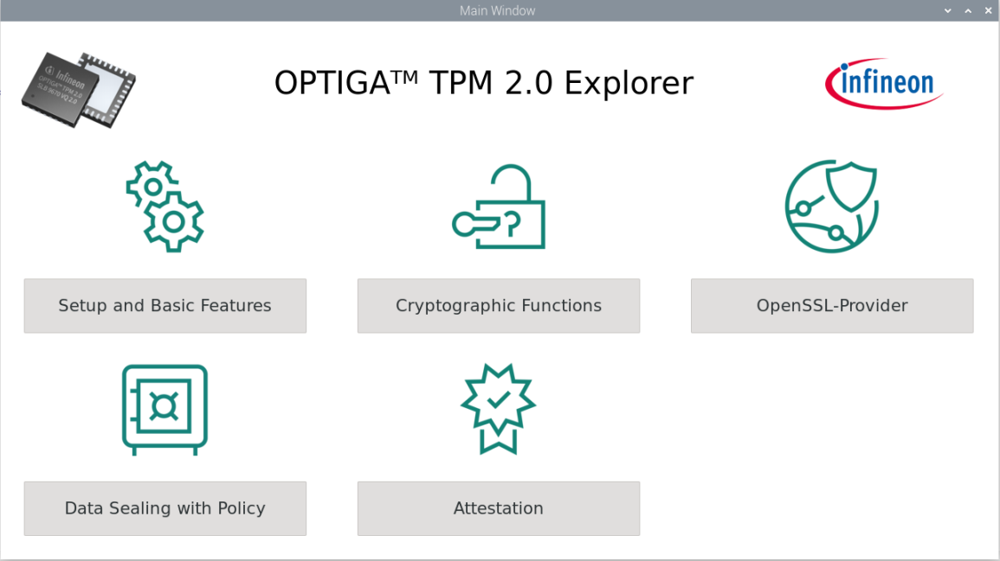
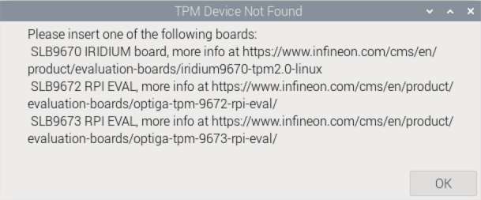

# **OPTIGA™ TPM 2.0 Explorer Setup Guide**

This page provides instructions on how to install and configure the Raspberry Pi® to enable the [OPTIGA™ TPM 2.0](https://www.infineon.com/cms/en/product/security-smart-card-solutions/optiga-embedded-security-solutions/optiga-tpm/?redirId=39899/) in order to use the OPTIGA™ TPM 2.0 Explorer.

- [Prerequisites](#prerequisites)
- [Installation](#installation)
- [Frequently Asked Questions](#frequently-asked-questions)
- [References](#references)

## Prerequisites 

This tool was tested on a Raspberry Pi (RPi) 3 Model B+/ RPi 4 Model B / RPi 5 with Debian Linux in Release Version 12 (Bookworm) and kernel version 6.12.25 using an Infineon OPTIGA™ TPM SLB 9670/72/73 TPM2.0 attached to the Raspberry Pi board.

|  |
| :-----------------------------------: |

Figure 1: Infineon OPTIGA™ TPM SLB 9672 RPI Evaluation Board on a Raspberry Pi 4


**Table 1** shows a summary of the hardware and environment used.

| Hardware                                    | Version   and Firmware/OS                                                                                                                                                                                                                                                                                                                                                                            | Comment                                                                                                                                                                                                                                                                                              |
| ------------------------------------------- | ---------------------------------------------------------------------------------------------------------------------------------------------------------------------------------------------------------------------------------------------------------------------------------------------------------------------------------------------------------------------------------------------------- | ---------------------------------------------------------------------------------------------------------------------------------------------------------------------------------------------------------------------------------------------------------------------------------------------------- |
| Host  PC/Laptop                             | Windows® 11 with VNC viewer                                                                                                                                                                                                                                                                                                                                                                          | This  is an alternative option to interacting with  the Raspberry Pi® in a more convenient and faster way without a monitor connected to Raspberry Pi®.                                                                                                                                              |
| OPTIGA™ TPM 2.0 evaluation boards supported | • [IRIDIUM9670 TPM2.0 LINUX](https://www.infineon.com/cms/en/product/evaluation-boards/iridium9670-tpm2.0-linux/) <br /> • [OPTIGA™ TPM SLB 9672 RPI evaluation board](https://www.infineon.com/cms/en/product/evaluation-boards/optiga-tpm-9672-rpi-eval/)<br /> • [OPTIGA™ TPM SLB 9673 RPI evaluation board](https://www.infineon.com/cms/en/product/evaluation-boards/optiga-tpm-9673-rpi-eval/) | These  boards contains Infineon OPTIGA™ TPM SLB 9670/72/73 TPM2.0 mounted on an  easy-to-use hardware board, which can be attached to the Raspberry Pi®.                                                                                                                                             |
| Raspberry  Pi® Board                        | •  Model 3 B+/ 4 B/ 5, Bookworm OS (2025-05-13) <br />  •  Micro SD Card with at least 16 GB <br />  •  Micro-B/ Type C USB cable for power supply                                                                                                                                                                                                                                                   | Raspberry Pi® Bookworm OS with kernel version 6.12.25  can be downloaded at [[1]](#references). <br />To setup the Raspberry Pi®, follow the [getting started guide](https://www.raspberrypi.com/documentation/computers/getting-started.html#raspberry-pi-imager) to setup the SD card accordingly. |

**Table 2** shows a summary of the software used.

| Software     | Version |
| :----------- | ------- |
| tpm2-tools   | 5.4.1   |
| tpm2-abrmd   | 3.0.0-1 |
| tpm-udev     | 0.6     |
| libtss2-*    | 3.2.1-3 |
| tpm2-openssl | 1.1.1-1 |

## Installation  

Download TPM Explorer Source Code:  
via: https://github.com/Infineon/optiga-tpm-explorer/releases
or 

via https:
```shell
git clone https://github.com/Infineon/optiga-tpm-explorer.git
```
Execute Installation script:
```shell
cd optiga-tpm-explorer
./installation_script.sh
```

Once complete, run the program by:

```shell
./start_gui.sh
```
OPTIGA™ TPM 2.0 Explorer main menu will appear.

|  |
| ------------------------------------------------------- |

**Figure 1**: Home Screen of OPTIGA™ TPM 2.0 Explorer

For more information on the OPTIGA™ TPM 2.0 Explorer, please refer to the [OPTIGA™ TPM 2.0 Explorer User Guide](./User%20Guide.md).

## Frequently Asked Questions 

If OPTIGA™ TPM 2.0 Explorer failed to launch:

|  |
| :------------------------------------------: |

**Figure 2**: Error message indicating 'Device not found' when opening the GUI tool

Open the configuration file in an editor:  

```shell
sudo nano /boot/firmware/config.txt   
```

Ensure the following settings are set:

For SLB9670 and SLB9672

```shell
dtparam=spi=on
dtoverlay=tpm-slb9670
```

For SLB9673

```shell
dtparam=i2c_arm=on
dtoverlay=tpm-slb9673
```

and reboot after saving the file.
## References

1.  https://downloads.raspberrypi.org/raspios_full_arm64/images/raspios_full_arm64-2025-05-13/
