# **OPTIGA™ TPM 2.0 Explorer User Guide**

# Navigation

- [Navigation](#navigation)
- [Overview](#overview)
- [Setup environment](#setup-environment)
- [Setup and Basic Features](#setup-and-basic-features)
  - [Setup](#setup)
    - [OPTIGA™ TPM Setup Functions](#optiga-tpm-setup-functions)
    - [TPM Startup](#tpm-startup)
    - [Viewing TPM (fixed) Capabilities](#viewing-tpm-fixed-capabilities)
    - [Changing Authorization values of TPM](#changing-authorization-values-of-tpm)
    - [Dictionary Attack](#dictionary-attack)
    - [TPM ClearLock](#tpm-clearlock)
  - [Platform Configuration Registers](#platform-configuration-registers)
    - [Platform Configuration Registers Functions](#platform-configuration-registers-functions)
    - [PCR Listing](#pcr-listing)
    - [PCR Extend and PCR Event](#pcr-extend-and-pcr-event)
  - [NVM and Certificate Management](#nvm-and-certificate-management)
    - [NVM and Certificate Management Functions](#nvm-and-certificate-management-functions)
    - [NV Define](#nv-define)
    - [NV Write](#nv-write)
    - [Reading Certificate](#reading-certificate)
    - [Writing File](#writing-file)
    - [NV Release](#nv-release)
  - [Handle Management](#handle-management)
    - [Handle Management Functions](#handle-management-functions)
    - [Handle Management List All](#handle-management-list-all)
    - [Handle Management Evict Persistent](#handle-management-evict-persistent)
- [Cryptographic Functions](#cryptographic-functions)
  - [Hash Cryptographic Functions](#hash-cryptographic-functions)
  - [RSA Cryptographic Functions](#rsa-cryptographic-functions)
    - [RSA Cryptographic Function Description](#rsa-cryptographic-function-description)
    - [Creating RSA Keypair](#creating-rsa-keypair)
    - [Encrypting and Decrypting RSA](#encrypting-and-decrypting-rsa)
    - [Signing and Verifying RSA](#signing-and-verifying-rsa)
  - [ECC Cryptographic Functions](#ecc-cryptographic-functions)
    - [ECC Cryptographic Function Description](#ecc-cryptographic-function-description)
    - [Creating ECC Keypair](#creating-ecc-keypair)
    - [Signing and Verifying ECC](#signing-and-verifying-ecc)
- [OpenSSL Provider](#openssl-provider)
  - [RSA (Enc/Dec/Sign/Verify)](#rsa-encdecsignverify)
    - [RSA (Enc/Dec/Sign/Verify) Function Description](#rsa-encdecsignverify-function-description)
      - [RSA Encryption and Decryption](#rsa-encryption-and-decryption)
      - [RSA Signing and Verification](#rsa-signing-and-verification)
  - [ECC (Sign/Verify)](#ecc-signverify)
    - [ECC (Sign/Verify) Function Description](#ecc-signverify-function-description)
      - [ECC Keypair Generation](#ecc-keypair-generation)
      - [ECC Signing and Verification](#ecc-signing-and-verification)
  - [Random Number Generator](#random-number-generator)
  - [RSA (Client/Server)](#rsa-clientserver)
    - [RSA (Client/Server) Function Description](#rsa-clientserver-function-description)
    - [Create Root CA and Its Certificate](#create-root-ca-and-its-certificate)
    - [Create Server Certificate](#create-server-certificate)
    - [Create an OpenSSL Server](#create-an-openssl-server)
    - [Create an OpenSSL Client](#create-an-openssl-client)
    - [Secure data exchange between Server and Client](#secure-data-exchange-between-server-and-client)
  - [ECC (Client/Server)](#ecc-clientserver)
    - [ECC (Client/Server) Function Description](#ecc-clientserver-function-description)
    - [Create Root CA and Its Certificate](#create-root-ca-and-its-certificate-1)
    - [Create Server Certificate](#create-server-certificate-1)
    - [Create an OpenSSL Server](#create-an-openssl-server-1)
    - [Creating an OpenSSL Client](#creating-an-openssl-client)
    - [Secure data exchange between Server and client](#secure-data-exchange-between-server-and-client-1)
- [Data Sealing with Policy](#data-sealing-with-policy)
  - [Data Sealing with Policy Function Description](#data-sealing-with-policy-function-description)
  - [Data Sealing with Policy Functions](#data-sealing-with-policy-functions)
    - [Data Sealing with Policy](#data-sealing-with-policy-1)
- [Attestation](#attestation)
  - [Attestation Function Description](#attestation-function-description)
  - [Generating Quote](#generating-quote)
  - [Verifying Quote](#verifying-quote)
  - [Evict AK/EK Handle](#evict-akek-handle)
- [References](#references)


# Overview

This document will guide you through all features implemented in the OPTIGA™ TPM 2.0 Explorer

# Setup environment

For more information on how to setup the tool environment, refer to the [OPTIGA™ TPM 2.0 Explorer Setup Guide](./Setup%20Guide.md)


# Setup and Basic Features

This section shows you the Setup features of the OPTIGA™ TPM 2.0 Explorer.

## Setup 

Select "Setup and Basic Features". Enter the OPTIGA™ TPM Setup Menu.

|  |
| -------------------------------------------------- |

Figure 2: Setup and Basic Features Selection


### OPTIGA™ TPM Setup Functions

Setup function descriptions 

| 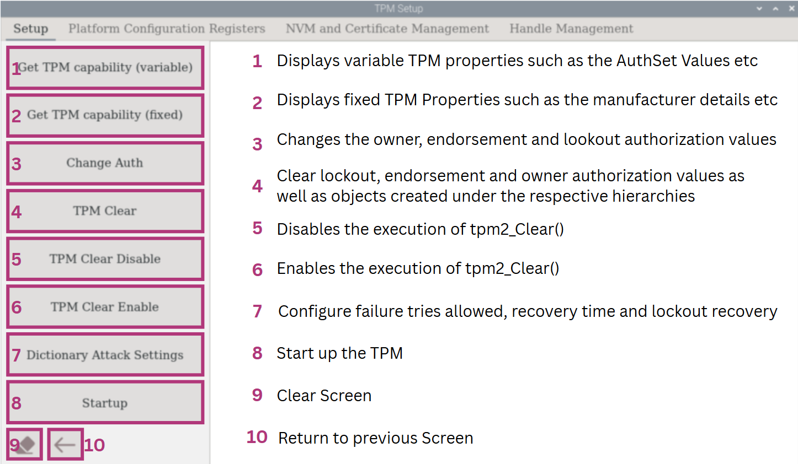 |
| -------------------------------------------------------- |

Figure 3: OPTIGA™ TPM Setup Menu Function Descriptions


 ### TPM Startup

The OPTIGA™ TPM will startup when the RPI is powered on. However, if the reset button is pressed, the TPM2_startup command must be invoked separately by clicking on the "Startup" button before running any TPM command or operation. Otherwise, error message will be displayed for example if  "Get TPM Capability (variable)" button is selected as follow.  


```shell
ERROR:esys:src/tss2-esys/api/Esys_GetCapability.c:307:Esys_GetCapability_Finish() Received a non-TPM Error 
ERROR:esys:src/tss2-esys/api/Esys_GetCapability.c:107:Esys_GetCapability() Esys Finish ErrorCode (0x000a0008) 
ERROR: Esys_GetCapability(0xA0008) - tcti:Fails to connect to next lower layer
ERROR: Unable to run tpm2_getcap
'tpm2_getcap properties-variable' executed 
++++++++++++++++++++++++++++++++++++++++++++
```

Error Message: Display TPM capability (variable) failure due to reset without running TPM2_startup


To startup the OPTIGA™ TPM, select the "Startup" button in the left panel. Then, check if the TPM is functional by selecting "Get TPM Capability (variable)". TPM variable parameters can now be displayed.  

```shell
'tpm2_startup -c' executed 
++++++++++++++++++++++++++++++++++++++++++++
TPM2_PT_PERMANENT:
  ownerAuthSet:              0
  endorsementAuthSet:        0
  lockoutAuthSet:            0
  reserved1:                 0
  disableClear:              0
  inLockout:                 0
  tpmGeneratedEPS:           1
  reserved2:                 0
TPM2_PT_STARTUP_CLEAR:
  phEnable:                  1
  shEnable:                  1
  ehEnable:                  1
  phEnableNV:                1
  reserved1:                 0
  orderly:                   0
TPM2_PT_HR_NV_INDEX: 0x3
TPM2_PT_HR_LOADED: 0x0
TPM2_PT_HR_LOADED_AVAIL: 0x3
TPM2_PT_HR_ACTIVE: 0x0
TPM2_PT_HR_ACTIVE_AVAIL: 0x40
TPM2_PT_HR_TRANSIENT_AVAIL: 0x3
TPM2_PT_HR_PERSISTENT: 0x5
TPM2_PT_HR_PERSISTENT_AVAIL: 0x3
......
'tpm2_getcap properties-variable' executed 
++++++++++++++++++++++++++++++++++++++++++++

```

Expected Output (Partial): Display TPM capability (variable) successfully after TPM2_startup


### Viewing TPM (fixed) Capabilities

The TPM capabilities (fixed) can be displayed using tpm2_getcap properties-fixed in TPM2 tools. The fixed capabilities shows important information such as the TPM vendor and the firmware version. It also displays the manufacturer as well as many other information.

To view fixed capabilities and details, select "Get TPM Capability (fixed)" button. Information such as the manufacturer, firmware and more can be found here. 

```shell
TPM2_PT_FAMILY_INDICATOR:
  raw: 0x322E3000
  value: "2.0"
TPM2_PT_LEVEL:
  raw: 0
TPM2_PT_REVISION:
  raw: 0x9F
  value: 1.59
TPM2_PT_DAY_OF_YEAR:
  raw: 0xAA
TPM2_PT_YEAR:
  raw: 0x7E4
TPM2_PT_MANUFACTURER:
  raw: 0x49465800
  value: "IFX"
TPM2_PT_VENDOR_STRING_1:
  raw: 0x534C4239
  value: "SLB9"
TPM2_PT_VENDOR_STRING_2:
  raw: 0x36373200
  value: "672"
......
'tpm2_getcap properties-fixed' executed 
++++++++++++++++++++++++++++++++++++++++++++
```

Expected Output (Partial): Setup Menu display Get TPM capability (fixed)


### Changing Authorization values of TPM

> [!Warning]
> **WARNING:** Performing a TPM Clear will result in the reset of the TPM.

First, perform a "TPM Clear" by selecting the corresponding button in the left panel so that the TPM will be reconfigured to default mode. Then select "Get TPM capability (variable)" to display default TPM variable parameters. When the owner, endorsement and lockout authorization values are not changed, the variable value should be '0'.

```shell
TPM2_PT_PERMANENT:
  ownerAuthSet:              0
  endorsementAuthSet:        0
  lockoutAuthSet:            0
```

Expected Output (Partial): After resetting to default mode, the owner, endorsement, and lockout authorization values should all be zero.


To change the lockout, endorsement, and owner authorization values of TPM, select "Change Auth" in the left panel.  In the pop-up dialog, click "SET ALL" to confirm the credentials. We’ll use the following values as an example.

| 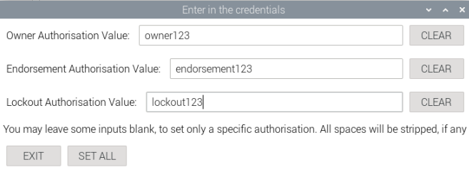 |
| :---------------------------------------------------: |

Figure 4: Configure authorization values in the pop-up dialog

Once successful, select "Get TPM capability (variable)" to confirm the results. The first 3 AuthSet values should be 1 once the owner, endorsement and lockout authorization value values are set. 

```shell
TPM2_PT_PERMANENT:
  ownerAuthSet:              1
  endorsementAuthSet:        1
  lockoutAuthSet:            1
```

Expected Output (Partial): If the owner, endorsement, and lockout authorization values are all set, the corresponding AuthSet values should all be one.


### Dictionary Attack

Select "Dictionary Attack Settings" in the left panel to configure settings for dictionary attacks. In the pop-up dialog, configure the dictionary attack settings and select "OK" to confirm. You can change the number of attempts before lockout, the time taken for recovery from failure and lockout recovery.

| 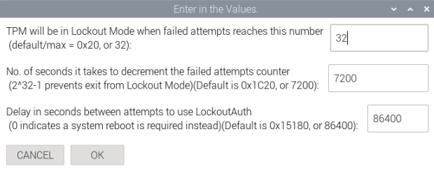 |
| :----------------------------------------------------------: |

Figure 5: Dictionary Attack Settings Configuration


If the Dictionary Attack Settings are successfully configured, the three following values will be changed accordingly when selecting "Get TPM capability (Variable)".

```shell
TPM2_PT_MAX_AUTH_FAIL: 0x20
TPM2_PT_LOCKOUT_INTERVAL: 0x1C20
TPM2_PT_LOCKOUT_RECOVERY: 0x15180
```

Expected Output (Partial): Dictionary Attack Settings Successfully Configured shown on TPM Capability (Variable)


### TPM ClearLock

The TPM ClearLock in TPM2 tools will effectively block/unblock lockout authorization handle for issuing TPM clear. This is to prevent TPM reset to default mode.

To disable 'tpm2_clear' command, select "TPM Clear Disable" in the left panel. Then, select "TPM Clear". It should fail.

```shell
'tpm2_clearcontrol -C l s -P 1' executed 
++++++++++++++++++++++++++++++++++++++++++++
WARNING:esys:src/tss2-esys/api/Esys_Clear.c:291:Esys_Clear_Finish() Received TPM Error 
ERROR:esys:src/tss2-esys/api/Esys_Clear.c:97:Esys_Clear() Esys Finish ErrorCode (0x00000120) 
ERROR: Esys_Clear(0x120) - tpm:error(2.0): the command is disabled
ERROR: Unable to run tpm2_clear
'tpm2_clear -c p' executed 
++++++++++++++++++++++++++++++++++++++++++++
```

Expected Output: TPM Clear Failed

To re-enable "TPM Clear", select "TPM Clear Enable" in the left panel. Then, perform a "TPM Clear" and check variable using "Get TPM capability (variable)" . AuthSet should be successfully cleared.

```shell
TPM2_PT_PERMANENT:
  ownerAuthSet:              0
  endorsementAuthSet:        0
  lockoutAuthSet:            0
```

Expected Output (Partial):  TPM Clear Succeed

## Platform Configuration Registers

This section shows you the functionalities of the PCR in the OPTIGA™ TPM.

From the "Setup and Basic Features" menu, select the "Platform Configuration Registers".


### Platform Configuration Registers Functions

Platform Configuration Register function descriptions

| 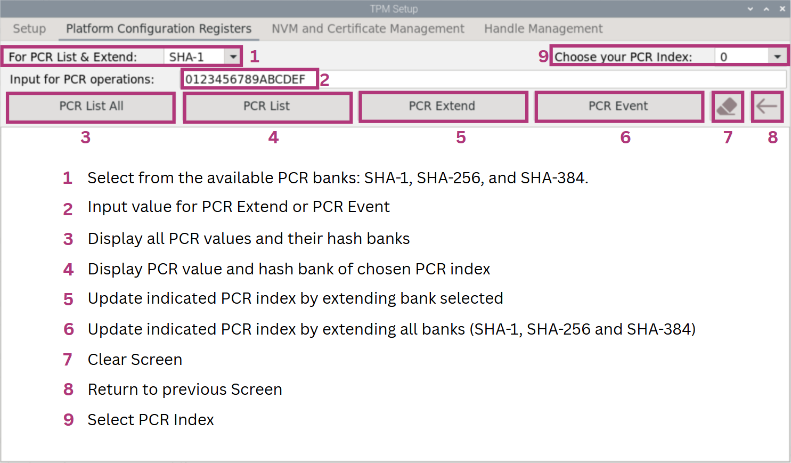 |
| -------------------------------------------------- |

Figure 6: OPTIGA™ TPM Platform Configuration Registers Functions Descriptions


### PCR Listing


To list all 24 PCRs using SHA-1/SHA-256/SHA-384, select the corresponding bank name from the dropdown at the top (SHA-1 as the default setting). A pop-up dialog will then be shown. Press the "RESET" button on the TPM to apply the change and select "Reset Pressed" in the dialog. Once done,  click 'PCR List All'.

|  |
| :------------------------------------------------: |

Figure 7: PCR List All 24 Registers in SHA-256


```shell
'tpm2_pcrallocate sha1:all+sha256:none' executed
'tpm2_startup --clear' executed
  sha256:
    0 : 0x0000000000000000000000000000000000000000000000000000000000000000
    1 : 0x0000000000000000000000000000000000000000000000000000000000000000
    2 : 0x0000000000000000000000000000000000000000000000000000000000000000
    3 : 0x0000000000000000000000000000000000000000000000000000000000000000
    ......
    17: 0xFFFFFFFFFFFFFFFFFFFFFFFFFFFFFFFFFFFFFFFFFFFFFFFFFFFFFFFFFFFFFFFF
    18: 0xFFFFFFFFFFFFFFFFFFFFFFFFFFFFFFFFFFFFFFFFFFFFFFFFFFFFFFFFFFFFFFFF
    19: 0xFFFFFFFFFFFFFFFFFFFFFFFFFFFFFFFFFFFFFFFFFFFFFFFFFFFFFFFFFFFFFFFF
    20: 0xFFFFFFFFFFFFFFFFFFFFFFFFFFFFFFFFFFFFFFFFFFFFFFFFFFFFFFFFFFFFFFFF
    ......
    23: 0x0000000000000000000000000000000000000000000000000000000000000000
'tpm2_pcrread shaxxx' executed 
++++++++++++++++++++++++++++++++++++++++++++
```

Expected Output (Partial): PCR List All 24 Registers in SHA-256 as an example


To view a specific register from the 24 available, first select a PCR index from the list at the top. Then, click the "PCR List" button to display the corresponding PCR value. You can also switch between SHA-1, SHA-256, and SHA-384 by using the dropdown menu at the top.


```shell
  sha1:
    1 : 0x0000000000000000000000000000000000000000
'tpm2_pcrread' executed 
++++++++++++++++++++++++++++++++++++++++++++
'tpm2_pcrallocate sha1:none+sha256:all' executed
'tpm2_startup --clear' executed
  sha256:
    1 : 0x0000000000000000000000000000000000000000000000000000000000000000
'tpm2_pcrread' executed 
++++++++++++++++++++++++++++++++++++++++++++
  sha256:
    20: 0xFFFFFFFFFFFFFFFFFFFFFFFFFFFFFFFFFFFFFFFFFFFFFFFFFFFFFFFFFFFFFFFF
'tpm2_pcrread' executed 
++++++++++++++++++++++++++++++++++++++++++++
```

Expected Output: Examples of PCR listing specific register in SHA-1 and SHA-256


### PCR Extend and PCR Event

To perform a PCR Extend, enter an input in the "Input for PCR operations" and select "PCR Extend". In this example, the default input of "0123456789ABCDEF" is used. Only the PCR bank and index selected will be extended. 

```shell
sha256:
    0 : 0x0000000000000000000000000000000000000000000000000000000000000000
'tpm2_pcrread' executed 
++++++++++++++++++++++++++++++++++++++++++++
Input= 123456789abcdef0000000000000000000000000000000000000000000000000
'tpm2_pcrextend' executed 
++++++++++++++++++++++++++++++++++++++++++++
  sha256:
    0 : 0x464D25FC35AC43941106533AC8C27A2E3AA4A4DE26D70A15A1BF85193BBA9349
'tpm2_pcrread' executed 
++++++++++++++++++++++++++++++++++++++++++++
```

Expected Output: PCR Extend function in SHA256


To perform a PCR Event, enter a value in the "Input for PCR operations" field and select the "PCR Event" option. In this example, the default input "0123456789ABCDEF" is used. All PCR banks—SHA-1, SHA-256, and SHA-384—will be extended accordingly, as shown below.

```shell
sha1: ce27cb141098feb00714e758646be3e99c185b71
sha256: 2125b2c332b1113aae9bfc5e9f7e3b4c91d828cb942c2df1eeb02502eccae9e9
sha384: 4d9f86403277358dbfd9250a5e7538a545b57404e69594238ab6d95a727788aac005cdf3e88ee26d5d2fa68e72e6d497
'tpm2_pcrevent' executed 
++++++++++++++++++++++++++++++++++++++++++++
```

Expected Output: PCR Event function


## NVM and Certificate Management

This section shows you the functionalities of the NVM and Certificate Management in the OPTIGA™ TPM.

From the "Setup and Basic Features" menu, select the "NVM and Certificate Management".


### NVM and Certificate Management Functions

NVM and Certificate Management function descriptions

| 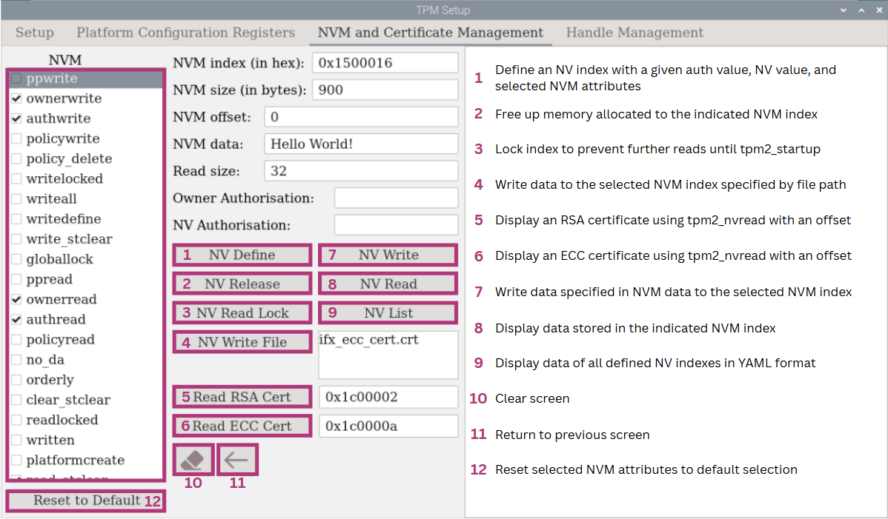 |
| --------------------------------------------------- |

Figure 8: OPTIGA™ TPM NVM and Certificate Management Functions Descriptions

 

### NV Define

Select the necessary NVM attributes, then enter the NVM index and size. By default, the owner authorization field is empty. If it was configured earlier in the "Setup" section, the corresponding value will automatically appear in the input field. For NV authorization, you may either leave the field blank or enter a value to set it manually. Click "NV Define", then "NV List" to verify that NVM index 0x1500016 has been successfully defined. This example uses the default attribute settings.

After selecting "NV List", all defined NVM indexes will be shown. NVM index 0x1500016 has been defined as shown below. In the box, Index 0x1c00002, 0x1c0000a and 0x1c00016 are Infineon EK certificates respectively and **should not** be edited.  

```shell
Attributes are: ownerwrite|authwrite|ownerread|authread|read_stclear
nv-index: 0x1500016
'tpm2_nvdefine' executed 
++++++++++++++++++++++++++++++++++++++++++++
0x1500016:
  name: 000b3582222e04749fb48f14a4f563f6d948c61318941f16d16383191b33e95fb261
  hash algorithm:
    friendly: sha256
    value: 0xB
  attributes:
    friendly: ownerwrite|authwrite|ownerread|authread|read_stclear
    value: 0x80060006
  size: 900

0x1c00002:
  name: 000bd91c8df868461c4d4fa966578da6d1fc64b486753d1d9dfb59bf3ee6387224bf
  hash algorithm:
    friendly: sha256
    value: 0xB
  attributes:
    friendly: ppwrite|writedefine|ppread|ownerread|authread|no_da|written|platformcreate
    value: 0x62072001
  size: 1429

0x1c0000a:
  name: 000bbf3b11b0e5ff0784f3a3741e5a593b5db538f7e9fde75551692fab30840323b6
  hash algorithm:
    friendly: sha256
    value: 0xB
  attributes:
    friendly: ppwrite|writedefine|ppread|ownerread|authread|no_da|written|platformcreate
    value: 0x62072001
  size: 846

0x1c00016:
  name: 000b046b18cf41cf4661193a87480ab93ca379ca625b303170858a302b4573727204
  hash algorithm:
    friendly: sha256
    value: 0xB
  attributes:
    friendly: ppwrite|writedefine|ppread|ownerread|authread|no_da|written|platformcreate
    value: 0x62072001
  size: 874

'tpm2_nvreadpublic' executed 
```

Expected Output: NV List Display


### NV Write

To write in the NV, enter what you wish to input in the NV in the "NVM data". Then select "NV Write" to write and "NV Read" to see what you have written.

```shell
'tpm2_nvwrite' executed 
++++++++++++++++++++++++++++++++++++++++++++
00000000: 4865 6c6c 6f20 576f 726c 6421 0000 0000  Hello World!....
00000010: 0000 0000 0000 0000 0000 0000 0000 0000  ................

'tpm2_nvread' executed 
++++++++++++++++++++++++++++++++++++++++++++
```

Expected Output: NV Write and NV Read display


### Reading Certificate

The "ifx_ecc_cert.crt" and the "ifx_rsa_cert.crt" will be created during "Read RSA Cert" and "Read ECC Cert" process. These are the EK Certificates that are inside handles 0x1c00002 and 0x1c0000a respectively.

To read RSA Cert in the NV, ensure that the RSA Cert index is correct and select "Read RSA Cert". In this example, we read the Infineon EK certificate "0x1c00002". A "ifx_rsa_cert.crt" will be created during "Read RSA Cert" process.


```shell
Certificate:
    Data:
        Version: 3 (0x2)
        Serial Number: 190513399 (0xb5b00f7)
        Signature Algorithm: sha384WithRSAEncryption
        Issuer: C = DE, O = Infineon Technologies AG, OU = OPTIGA(TM), CN = Infineon OPTIGA(TM) TPM 2.0 RSA CA 056
        Validity
            Not Before: Jul  4 16:41:34 2021 GMT
            Not After : Jul  4 16:41:34 2036 GMT
        Subject: 
        Subject Public Key Info:
            Public Key Algorithm: rsaEncryption
                Public-Key: (2048 bit)
                Modulus:
                    00:ca:2f:cf:35:a8:95:e2:ff:5c:a4:10:b5:10:ec:
                    ae:96:5d:6e:e8:be:f4:8f:f1:28:e6:fc:82:68:3f:
                    ......

```


Expected Output (Partial): Example of reading RSA Cert


To read ECC Cert in the NV, ensure that the ECC Cert index is correct and select "Read ECC Cert". In this example, we read the Infineon EK certificate "0x1c0000a". A "ifx_ecc_cert.crt" will be created during "Read ECC Cert" process.


```shell
Certificate:
    Data:
        Version: 3 (0x2)
        Serial Number: 708618584 (0x2a3ca958)
        Signature Algorithm: ecdsa-with-SHA512
        Issuer: C = DE, O = Infineon Technologies AG, OU = OPTIGA(TM), CN = Infineon OPTIGA(TM) TPM 2.0 ECC CA 056
        Validity
            Not Before: Jul  4 16:40:24 2021 GMT
            Not After : Jul  4 16:40:24 2036 GMT
        Subject: 
        Subject Public Key Info:
            Public Key Algorithm: id-ecPublicKey
                Public-Key: (256 bit)
                pub:
                    04:b9:56:51:85:c8:34:f5:86:6b:46:cd:ad:53:3b:
                    3f:84:40:9e:0a:5c:f1:57:44:7f:a1:9e:c4:f0:ad:
                    4b:bb:40:a7:21:e6:8b:cc:33:31:57:aa:4c:56:5e:
					......
```


Expected Output  (Partial): Example of reading ECC Cert


### Writing File

To write a file, click the file name field, which defaults to "ifx_ecc_cert.crt". After selecting the desired file, the file path will be automatically updated. In this example, a local ifx_ecc_cert.crt file is selected and NVM index 0x1500016 is used. Click "NV Write File" to write the selected file to this index.

To verify the operation, input appropriate read size and click "NV Read" to read the file you have just written.

```shell
'tpm2_nvwrite' executed 
++++++++++++++++++++++++++++++++++++++++++++
00000000: 3082 034a 3082 02ab a003 0201 0202 042a  0..J0..........*
00000010: 3ca9 5830 0a06 082a 8648 ce3d 0403 0430  <.X0...*.H.=...0
00000020: 7631 0b30 0906 0355 0406 1302 4445 3121  v1.0...U....DE1!
00000030: 301f 0603 5504 0a0c 1849 6e66 696e 656f  0...U....Infineo
00000040: 6e20 5465 6368 6e6f 6c6f 6769 6573 2041  n Technologies A
00000050: 4731 1330 1106 0355 040b 0c0a 4f50 5449  G1.0...U....OPTI
00000060: 4741 2854 4d29 312f 302d 0603 5504 030c  GA(TM)1/0-..U...
00000070: 2649 6e66 696e 656f 6e20 4f50 5449 4741  &Infineon OPTIGA
00000080: 2854 4d29 2054 504d 2032 2e30 2045 4343  (TM) TPM 2.0 ECC
00000090: 2043 4120 3035 3630 1e17 0d32 3130 3730   CA 0560...21070
......

'tpm2_nvread' executed 
++++++++++++++++++++++++++++++++++++++++++++
```


Expected Output (Partial): Reading NV Written file

As an ECC cert was written, we can also use "Read ECC Cert" by entering the corresponding NVM index (0x1500016 in this example) to show the certificate in the proper format.  


```shell
Certificate:
    Data:
        Version: 3 (0x2)
        Serial Number: 708618584 (0x2a3ca958)
        Signature Algorithm: ecdsa-with-SHA512
        Issuer: C = DE, O = Infineon Technologies AG, OU = OPTIGA(TM), CN = Infineon OPTIGA(TM) TPM 2.0 ECC CA 056
        Validity
            Not Before: Jul  4 16:40:24 2021 GMT
            Not After : Jul  4 16:40:24 2036 GMT
        Subject: 
        Subject Public Key Info:
            Public Key Algorithm: id-ecPublicKey
                Public-Key: (256 bit)
                pub:
                    04:b9:56:51:85:c8:34:f5:86:6b:46:cd:ad:53:3b:
                    3f:84:40:9e:0a:5c:f1:57:44:7f:a1:9e:c4:f0:ad:
                    4b:bb:40:a7:21:e6:8b:cc:33:31:57:aa:4c:56:5e:
					......
```

Expected Output (Partial): Reading NV written file using Read ECC Cert


### NV Release

To delete an NV index, select "NV Release". Select "NV List" to ensure that it is a success. 0x1500016 should be released.


```shell
++++++++++++++++++++++++++++++++++++++++++++
'tpm2_nvrelease' executed 
++++++++++++++++++++++++++++++++++++++++++++
0x1c00002:
  name: 000bd91c8df868461c4d4fa966578da6d1fc64b486753d1d9dfb59bf3ee6387224bf
  ......

0x1c0000a:
  name: 000bbf3b11b0e5ff0784f3a3741e5a593b5db538f7e9fde75551692fab30840323b6
  ......
  
0x1c00016:
  name: 000b046b18cf41cf4661193a87480ab93ca379ca625b303170858a302b4573727204
  ......

'tpm2_nvreadpublic' executed 
++++++++++++++++++++++++++++++++++++++++++++
```


Expected Output (Partial): NV Release and NV List default


## Handle Management

This section shows you the functionalities of Handle Management in the OPTIGA™ TPM. The handle management is used to manage all persistent and transient keys in the OPTIGA™ TPM. It is necessary as there is a limit of 3 transient and 7 persistent keys. Hence, handle management can evict persistent keys or flush transient keys to make for more transient and persistent keys.

###  Handle Management Functions

Handle Management function descriptions.

| 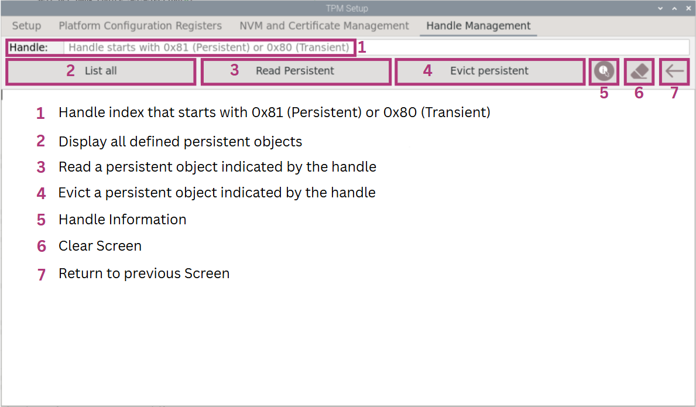 |
| ------------------------------------------------------------ |

Figure 9: OPTIGA™ TPM Handle Management Functions Descriptions


### Handle Management List All


Select "List All" to list all persistent handles. All persistent handles will be listed. You should have no persistent handles shown. Refer to **3.3.2** in order to create a persistent handle. Section 3.3.2 creates a Primary Key which in its process makes the handle 0x81000006 persisted. Once done, it will be listed when selecting the handle management "List all" button.


```shell
- 0x81000006
'tpm2_getcap handles-persistent' executed 
++++++++++++++++++++++++++++++++++++++++++++
```

Input a persisted handle (0x81000006 as an example here) and select "Read Persistent" to see the information of the persistent handle selected.  The information of the persistent handle will shown on the display.

```shell
name: 000bba84e5c944b7fc4d96a7edee44924afd0857e0ce1b1811bc552102fb89b0e983
qualified name: 000be59e818092815f8cc6d4ad9e8c13b0d23c195a1a3235e7629c15380063817dd7
name-alg:
  value: sha256
  raw: 0xb
attributes:
  value: fixedtpm|fixedparent|sensitivedataorigin|userwithauth|restricted|decrypt
  raw: 0x30072
type:
  value: ecc
  raw: 0x23
......
  value: cfb
  raw: 0x43
sym-keybits: 128
x: 323e75f8b0fa4d7576329c6a0c1f656b8ec478c80af3badc544e1ff662ef47f9
y: f9f9f5eea71c1bd5380489d19c807e32d677f1db32e35245159d137b2a0c2b11
'tpm2_readpublic -c 0x81000006' executed 
++++++++++++++++++++++++++++++++++++++++++++
```


Expected Output (Partial): Handle Management Read Persistent Display


### Handle Management Evict Persistent

Once a persistent handle is created under section 3.3.2 (0x81000006 as an example here), the persistent handle 0x81000006 can be evicted to make space for more persistent handles.

To evict persistent, input the correct handle value and select "Evict persistent". Once executed, the persistent handle "0x81000006" should be evicted as shown below.


```shell
persistent-handle: 0x81000006
action: evicted
'tpm2_evictcontrol -C o -c 0x81000006 -P ' executed 
++++++++++++++++++++++++++++++++++++++++++++
'tpm2_getcap handles-persistent' executed 
++++++++++++++++++++++++++++++++++++++++++++
```


Expected Output: Handle Management Evict Persistent List All Screen


# Cryptographic Functions

This section shows you the Cryptographic Functions of the OPTIGA™ TPM. It can be used to hash, encrypt/decrypt or sign and verify using OpenSSL or the TPM2 tools.

Go back to the main screen and select "Cryptographic Functions".


## Hash Cryptographic Functions

The hash function in this user interface only supports SHA-256. To hash with another algorithm, you can use "tpm2_hash" command in the terminal.

First, select "Hash" in the Cryptographic Functions. To hash an input, enter an input and select "Hash (SHA-2). 

```shell
00000000: b79e 508e 7caf 32f2 b884 1cdb e678 8600  ..P.|.2......x..
00000010: 0e94 a8e0 bcd2 dcfe ef0a 9dc6 790b e961  ............y..a

Hashing it...
Executing: tpm2_hash -C o -g sha256 -o hash.data -t ticketfile data_for_hash.data
++++++++++++++++++++++++++++++++++++++++++++
```

Expected Output: Cryptographic Hash Display with Default Input 12345


## RSA Cryptographic Functions

Select "RSA".

### RSA Cryptographic Function Description

RSA Cryptographic Function Description

| 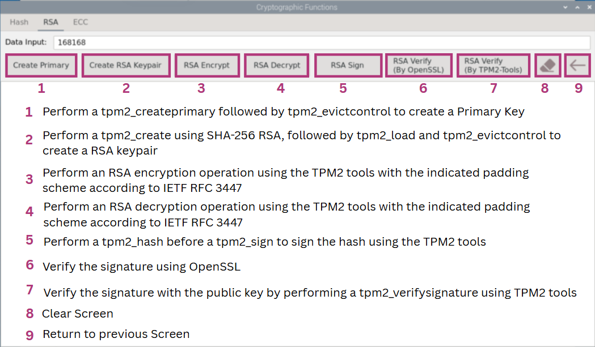 |
| ------------------------------------------------------- |

Figure 10: RSA Cryptographic Function Description


### Creating RSA Keypair

To create RSA keypair, create a primary key first by selecting "Create Primary". 

If a persistent handle (0x81000004) is already in use, tpm2_evictcontrol may be used to evict the existing object from that handle. The command tpm2_createprimary will then be performed followed by a tpm2_evictcontrol to make it persistent using TPM2 tools. The primary key is created with a parameter 'o' under the storage hierarchy.

```shell
Creating RSA Primary Key (may take a while)...
name-alg:
  value: sha256
  raw: 0xb
attributes:
  value: fixedtpm|fixedparent|sensitivedataorigin|userwithauth|restricted|decrypt
  raw: 0x30072
type:
  value: rsa
  raw: 0x1
exponent: 65537
bits: 2048
scheme:
  value: null
  raw: 0x10
......

tpm2_evictcontrol -C o -P  -c 0x81000004 
tpm2_createprimary -C o -P  -g sha256 -G rsa -c RSAprimary.ctx
tpm2_evictcontrol -C o -c RSAprimary.ctx -P  0x81000004
++++++++++++++++++++++++++++++++++++++++++++
```

Expected Output (Partial): Cryptographic Functions RSA Create Primary Succeeded


Next, create RSA keypair by selecting "Create RSA Keypair". RSA Keypair successfully created. 

If a persistent handle (0x81000005) is already in use, tpm2_evictcontrol may be used to evict the existing object from that handle. The command tpm2_create was used to create a RSA key pair under the storage hierarchy. The created key pair was then loaded to the TPM with tpm2_load. Finally, the RSA key was made to be persistent with tpm2_evictcontrol.

```shell
Creating RSA Key Pair... 
name-alg:
  value: sha256
  raw: 0xb
attributes:
  value: fixedtpm|fixedparent|sensitivedataorigin|userwithauth|decrypt|sign
  raw: 0x60072
type:
  value: rsa
  raw: 0x1
exponent: 65537
bits: 2048
scheme:
  value: null
  raw: 0x10
......
tpm2_evictcontrol -C o -P  -c 0x81000005 
tpm2_create -C 0x81000004 -g sha256 -G rsa -r RSAPriv.key -u RSAPub.key
tpm2_load -C 0x81000004 -u RSAPub.key -r RSAPriv.key -n RSAkey_name_structure.data -c RSAkeycontext.ctx
tpm2_evictcontrol -a o -c RSAkeycontext.ctx -p 0x81000005 -P 
```

Expected Output (Partial): Create RSA Keypair succeeded


### Encrypting and Decrypting RSA

To encrypt an input using RSA key, enter your input and select "RSA Encrypt".

```shell
Encryted message is:
00000000: 7c7b c95d 7365 f832 b5a0 bca8 0a2d c091  |{.]se.2.....-..
00000010: 1e36 9546 fb15 9d30 0a44 01f0 de72 2cc6  .6.F...0.D...r,.
00000020: 4bef 9c14 01e1 15ce 6f38 60cd 992b e7c5  K.......o8`..+..
00000030: 1a66 1200 decb 51b0 dc8b 3f15 09a2 ffb3  .f....Q...?.....
00000040: f6e4 1352 fb76 1420 f2d9 a13b 9809 b442  ...R.v. ...;...B
......
000000f0: 7f2f acf4 af24 cd9a 777b 8d67 29ca 596f  ./...$..w{.g).Yo

tpm2_rsaencrypt -c 0x81000005 -o data_encrypted.txt datain.txt
++++++++++++++++++++++++++++++++++++++++++++
```

Expected Output (Partial): RSA Encrypt with Default Input 168168


The data has been encrypted.

| 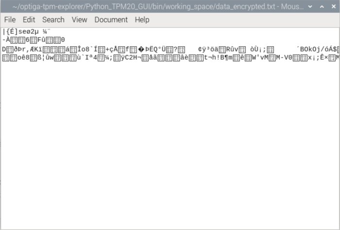 |
| :----------------------------------------------------------: |

Figure 11: Encrypted “data_encrypted.txt” shown in unreadable form


To decrypt encrypted data using RSA key, simply select "RSA Decrypt". Data has been decrypted.

```shell
Decrypted message is:
168168
tpm2_rsadecrypt -c 0x81000005 -p RSAleaf123 -o dataout.txt data_encrypted.txt
++++++++++++++++++++++++++++++++++++++++++++
```

Expected Output: RSA Decrypt succeeded


### Signing and Verifying RSA

To perform RSA Sign, select "RSA Sign".

```shell
Signing Data Input with RSA Private Key... 
WARN: Ignoring the specified validation ticket since no TPM calculated digest specified.

Signature blob is:
00000000: 0014 000b 0100 061f 21e9 ec9c d421 bc4a  ........!....!.J
00000010: 129f 4143 8f3d 0672 996e 69ce 2d8a 5f5c  ..AC.=.r.ni.-._\
00000020: 9a1e 2ced ad8b a01c 2084 4dbf 1e20 216a  ..,..... .M.. !j
......
00000100: a693 5279 edc0                           ..Ry..

Signature data is:
00000000: 061f 21e9 ec9c d421 bc4a 129f 4143 8f3d  ..!....!.J..AC.=
00000010: 0672 996e 69ce 2d8a 5f5c 9a1e 2ced ad8b  .r.ni.-._\..,...
00000020: a01c 2084 4dbf 1e20 216a 48ff 87fa dddb  .. .M.. !jH.....
......
000000f0: e05b 30bd 3441 7a12 2dd5 a693 5279 edc0  .[0.4Az.-...Ry..

tpm2_hash -C o -g 0x00B -o hash.bin -t ticket.bin datain.txt
tpm2_sign -c 0x81000005 -p RSAleaf123 -g sha256 -o signature_blob -t ticket.bin  datain.txt
tpm2_sign -c 0x81000005 -p RSAleaf123 -g sha256 -o signature_data -f plain datain.txt
++++++++++++++++++++++++++++++++++++++++++++
```

Expected Output (Partial): RSA Sign

To verify signature using **OpenSSL**, select "RSA Verify (By OpenSSL)". A success message "Verified OK" should be displayed if "Data Input" is correct.


```shell
name: 000b687c6e06f01dd2b25ce1f3619d7044f8dafa3b8c55981434b9195ed28d35b272
qualified name: 000b15929a2ab6d21480730281eedae4e9730fbbaa8c8979fbfb35836836db6e240c
name-alg:
  value: sha256
  raw: 0xb
attributes:
  value: fixedtpm|fixedparent|sensitivedataorigin|userwithauth|decrypt|sign
  raw: 0x60072
type:
  value: rsa
  raw: 0x1
exponent: 65537
bits: 2048
......
Exponent: 65537 (0x10001)
Verified OK

tpm2_readpublic -c 0x81000005 -f pem -o RSAkey.pem
openssl rsa -in RSAkey.pem -pubin -noout -text
openssl dgst -verify RSAkey.pem -keyform pem -sha256 -signature signature_data datain.txt
++++++++++++++++++++++++++++++++++++++++++++
```

Expected Output (Partial): RSA signature check with OpenSSL succeeded with default input 168168

If "Data Input" is wrong, an error message "Verification Failure" will be displayed.

```shell
name: 000b687c6e06f01dd2b25ce1f3619d7044f8dafa3b8c55981434b9195ed28d35b272
qualified name: 000b15929a2ab6d21480730281eedae4e9730fbbaa8c8979fbfb35836836db6e240c
name-alg:
  value: sha256
  raw: 0xb
attributes:
  value: fixedtpm|fixedparent|sensitivedataorigin|userwithauth|decrypt|sign
  raw: 0x60072
type:
  value: rsa
  raw: 0x1
exponent: 65537
bits: 2048
......
Exponent: 65537 (0x10001)
40604B8D7F000000:error:02000068:rsa routines:ossl_rsa_verify:bad signature:../crypto/rsa/rsa_sign.c:430:
40604B8D7F000000:error:1C880004:Provider routines:rsa_verify:RSA lib:../providers/implementations/signature/rsa_sig.c:774:
Verification failure

tpm2_readpublic -c 0x81000005 -f pem -o RSAkey.pem
openssl rsa -in RSAkey.pem -pubin -noout -text
openssl dgst -verify RSAkey.pem -keyform pem -sha256 -signature signature_data datain.txt
++++++++++++++++++++++++++++++++++++++++++++
```

Expected Output (Partial): RSA signature check with OpenSSL failed with input 168168123

To verify signature using TPM2 tools, select "RSA Verify (By TPM)" to perform a 'tpm2_verifysignature'. No error messages should be displayed if "Data Input" is correct.

```shell
Verifying signature using RSA Public Key... 
name: 000b687c6e06f01dd2b25ce1f3619d7044f8dafa3b8c55981434b9195ed28d35b272


Verification completed
tpm2_loadexternal -C o -u RSAPub.key -c RSAverifyleaf.ctx
tpm2_verifysignature -c RSAverifyleaf.ctx -g sha256 -m datain.txt -s signature_blob -t ticket.bin
++++++++++++++++++++++++++++++++++++++++++++
```

Expected Output: RSA signature check with TPM2 tools succeeded with default input 168168

If "Data Input" is wrong, error messages will be displayed to indicate failure.

```shell
Verifying signature using RSA Public Key... 
name: 000b687c6e06f01dd2b25ce1f3619d7044f8dafa3b8c55981434b9195ed28d35b272

WARNING:esys:src/tss2-esys/api/Esys_VerifySignature.c:302:Esys_VerifySignature_Finish() Received TPM Error 
ERROR:esys:src/tss2-esys/api/Esys_VerifySignature.c:103:Esys_VerifySignature() Esys Finish ErrorCode (0x000002db) 
ERROR: Esys_VerifySignature(0x2DB) - tpm:parameter(2):the signature is not valid
ERROR: Verify signature failed!
ERROR: Unable to run tpm2_verifysignature

Verification completed
tpm2_loadexternal -C o -u RSAPub.key -c RSAverifyleaf.ctx
tpm2_verifysignature -c RSAverifyleaf.ctx -g sha256 -m datain.txt -s signature_blob -t ticket.bin
++++++++++++++++++++++++++++++++++++++++++++
```

Expected Output: RSA signature check with TPM2 tools failed with input 168168123


## ECC Cryptographic Functions

Select "ECC".

### ECC Cryptographic Function Description

ECC Cryptographic Function Description

| 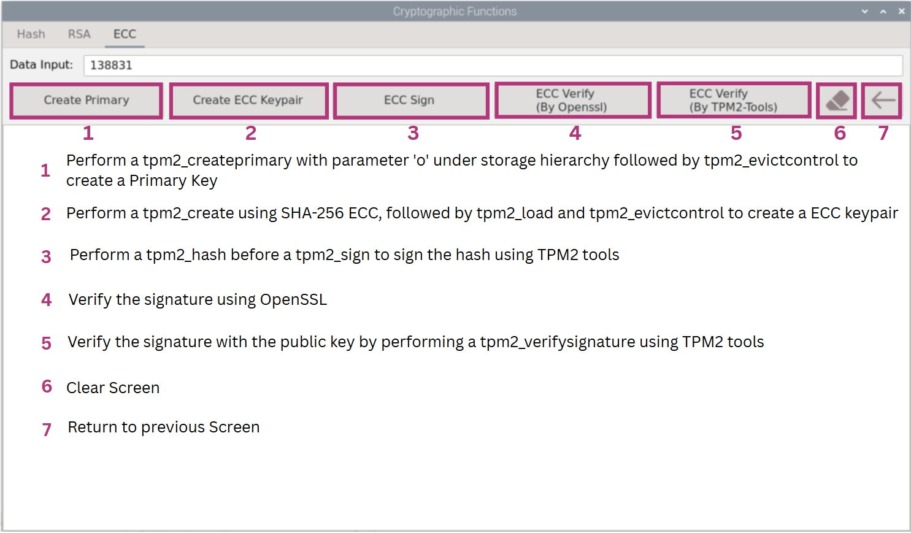 |
| ------------------------------------------------------------ |

Figure 12: ECC Cryptographic Function Description


### Creating ECC Keypair

To create a ECC keypair, create a primary key first by selecting "Create Primary" to create primary key for ECC.

If a persistent handle (0x81000006) is already in use, tpm2_evictcontrol may be used to evict the existing object from that handle. The command tpm2_createprimary will then be performed followed by a tpm2_evictcontrol to make it persistent using TPM2 tools. The primary key is created with a parameter 'o' under the storage hierarchy.

```shell
Creating ECC Primary Key... 
name-alg:
  value: sha256
  raw: 0xb
attributes:
  value: fixedtpm|fixedparent|sensitivedataorigin|userwithauth|restricted|decrypt
  raw: 0x30072
type:
  value: ecc
  raw: 0x23
curve-id:
  value: NIST p256
  raw: 0x3
......

tpm2_evictcontrol -C o -P  -c 0x81000006 
tpm2_createprimary -C o -P  -g sha256 -G 0x0023 -c ECCprimary.ctx
tpm2_evictcontrol -C o -c ECCprimary.ctx -p 0x81000006 -P 
++++++++++++++++++++++++++++++++++++++++++++
```

Expected Output (Partial): Create Primary succeeded


Next, create ECC keypair by selecting "Create ECC Keypair".  ECC Keypair successfully created. 

If a persistent handle (0x81000007) is already in use, tpm2_evictcontrol may be used to evict the existing object from that handle. The command tpm2_create was used to create a ECC key pair under the storage hierarchy. The created key pair was then loaded to the TPM with tpm2_load. Finally, the ECC key was made to be persistent with tpm2_evictcontrol.

```shell
Creating ECC Key Pair... 
name-alg:
  value: sha256
  raw: 0xb
attributes:
  value: fixedtpm|fixedparent|sensitivedataorigin|userwithauth|decrypt|sign
  raw: 0x60072
type:
  value: ecc
  raw: 0x23
curve-id:
  value: NIST p256
  raw: 0x3
......
tpm2_evictcontrol -C o -P  -c 0x81000007 
tpm2_create -C 0x81000006 -p ECCleaf123 -g sha256 -G ecc -r ECCpri.key -u ECCpub.key
tpm2_load -C 0x81000006 -u ECCpub.key -r ECCpri.key -n ECCname.data -c ECCkeycontext.ctx
tpm2_evictcontrol -C o -c ECCkeycontext.ctx -P  0x81000007
++++++++++++++++++++++++++++++++++++++++++++
```

Expected Output (Partial): Create ECC Keypair succeeded


### Signing and Verifying ECC

To perform ECC Sign, select "ECC Sign".

```shell
Signing Data with ECC Private Key... 
Signing using ECC key, with SHA256 algo...

Signature data is:
00000000: 3045 0221 0092 e808 53ab b9f0 c866 ee78  0E.!....S....f.x
00000010: 415a d0a5 c933 cc5d 94bc 3f00 90ba cd90  AZ...3.]..?.....
00000020: c04c c5c7 f502 2010 901d f564 565a 1fdc  .L.... ....dVZ..
00000030: d57c 81d0 16e9 a63f c4d3 b50f 49aa 1fe5  .|.....?....I...
00000040: 36e7 d781 28a7 ec                        6...(..


Signature blob is:
00000000: 0018 000b 0020 9962 7f7b 7d06 693e 6de4  ..... .b.{}.i>m.
00000010: 9e27 9d7c 1347 3696 39e5 32dd 3cda 93dc  .'.|.G6.9.2.<...
00000020: 3807 f014 68dd 0020 85d1 2613 a4e6 3123  8...h.. ..&...1#
00000030: 3967 ee9a 2c90 1abc 6314 3341 958e 5659  9g..,...c.3A..VY
00000040: 65d2 7a4c 5065 ef3a                      e.zLPe.:

tpm2_sign -c 0x81000007 -p ECCleaf123 -g sha256 -o signature_data -f plain secret.data
tpm2_sign -c 0x81000007 -p ECCleaf123 -g sha256 -o signature_blob secret.data
++++++++++++++++++++++++++++++++++++++++++++
```

Expected Output: ECC Sign with default input 138831

To verify signature using **OpenSSL**, select "ECC Verify (By OpenSSL)". A success message "Verified OK" should be displayed if "Data Input" is correct.

```shell
Verifying Data with ECC Public Key using Openssl... 
name: 000bad711766cf426f5c23f427f93fc738d08a47e840e4bbe8eafff0cef87ac9bf4d
qualified name: 000b8ef99c766dc0867f225bdabe8722894622fb55a910a2be45c53b27218f6428c4
name-alg:
  value: sha256
  raw: 0xb
attributes:
  value: fixedtpm|fixedparent|sensitivedataorigin|userwithauth|decrypt|sign
  raw: 0x60072
type:
  value: ecc
  raw: 0x23
......
Verified OK

tpm2_readpublic -c 0x81000007 -f pem -o ECCkey.pem
openssl dgst -verify ECCkey.pem -keyform pem -sha256 -signature signature_data secret.data
++++++++++++++++++++++++++++++++++++++++++++
```

Expected Output (Partial): ECC signature check with OpenSSL succeeded with default input 138831

If "Data Input" is wrong, an error message "Verification Failure" will be displayed.

```shell
Verifying Data with ECC Public Key using Openssl... 
name: 000bad711766cf426f5c23f427f93fc738d08a47e840e4bbe8eafff0cef87ac9bf4d
qualified name: 000b8ef99c766dc0867f225bdabe8722894622fb55a910a2be45c53b27218f6428c4
name-alg:
  value: sha256
  raw: 0xb
attributes:
  value: fixedtpm|fixedparent|sensitivedataorigin|userwithauth|decrypt|sign
  raw: 0x60072
type:
  value: ecc
  raw: 0x23
......
Verification failure

tpm2_readpublic -c 0x81000007 -f pem -o ECCkey.pem
openssl dgst -verify ECCkey.pem -keyform pem -sha256 -signature signature_data secret.data
++++++++++++++++++++++++++++++++++++++++++++
```

Expected Output (Partial): ECC signature check with OpenSSL failed with input 138831123

To verify signature using TPM2 tools, select "ECC Verify (By TPM)" to perform a 'tpm2_verifysignature'. No error messages should be displayed if "Data Input" is correct.

```shell
Verifying Data with ECC Public Key using TPM2-Tools...
name: 000bad711766cf426f5c23f427f93fc738d08a47e840e4bbe8eafff0cef87ac9bf4d


Verification completed
tpm2_loadexternal -C o -u ECCpub.key -c ECCverifyleaf.ctx
tpm2_verifysignature -c ECCverifyleaf.ctx -g sha256 -m secret.data -s signature_blob
++++++++++++++++++++++++++++++++++++++++++++
```

Expected Output: ECC signature check with TPM2 tools succeeded with default input 138831

If "Data Input" is wrong, error messages will be displayed to indicate failure.

```shell
Verifying Data with ECC Public Key using TPM2-Tools...
name: 000bad711766cf426f5c23f427f93fc738d08a47e840e4bbe8eafff0cef87ac9bf4d

WARNING:esys:src/tss2-esys/api/Esys_VerifySignature.c:302:Esys_VerifySignature_Finish() Received TPM Error 
ERROR:esys:src/tss2-esys/api/Esys_VerifySignature.c:103:Esys_VerifySignature() Esys Finish ErrorCode (0x000002db) 
ERROR: Esys_VerifySignature(0x2DB) - tpm:parameter(2):the signature is not valid
ERROR: Verify signature failed!
ERROR: Unable to run tpm2_verifysignature

Verification completed
tpm2_loadexternal -C o -u ECCpub.key -c ECCverifyleaf.ctx
tpm2_verifysignature -c ECCverifyleaf.ctx -g sha256 -m secret.data -s signature_blob
++++++++++++++++++++++++++++++++++++++++++++
```
Expected Output: ECC signature check with TPM failed with input 138831132


# OpenSSL Provider

OpenSSL is an open-source tool that is commonly used for the Transport Layer Security (TLS) protocol. TLS is used by web services and IoT devices to transmit sensitive information between client/Endpoint and Server/Cloud applications.

This section shows you the OpenSSL-Provider functions of the OPTIGA™ TPM. The OpenSSL-Provider can be used to create an RSA/ECC(Client/Server) or do encryption/decryption or signing and verification. It can also be used to to random number generation.

Go back to the main screen and select "OpenSSL-Provider".


## RSA (Enc/Dec/Sign/Verify)

This section shows the uses of OpenSSL libraries to do encryption, decryption, signing and verification.

Select "RSA (Enc/Dec/Sign/Verify)".


### RSA (Enc/Dec/Sign/Verify) Function Description

RSA (Enc/Dec/Sign/Verify) Function Description

| 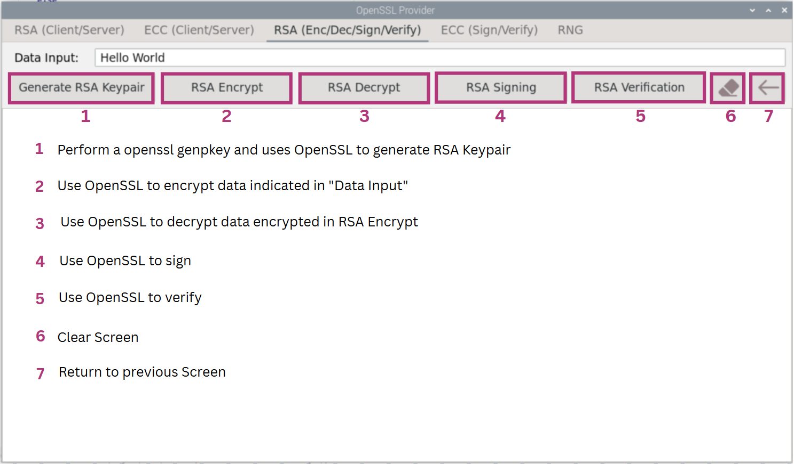 |
| ------------------------------------------------------------ |

Figure 13: RSA (Enc/Dec/Sign/Verify) Function Description


#### RSA Encryption and Decryption

To perform RSA functions, select "Generate RSA Keypair". RSA key is generated under storage hierarchy.

```shell
Setting up TPM...
Warning: generating random key material may take a long time
if the system has a poor entropy source
'openssl genpkey -provider tpm2 -algorithm RSA -out rsa2.pem' executed 
'openssl pkey -provider tpm2 -provider default -in rsa2.pem -pubout -out rsa2.pub.pem' executed 
rsa2.pem contains: 
-----BEGIN TSS2 PRIVATE KEY-----
MIICEgYGZ4EFCgEDoAMBAQECBEAAAAEEggEYARYAAQALAAYAcgAAABAAEAgAAAAA
AAEAnK506VUnNOpyxrArXFPtCLAHIsxYIIgGlvfBpN/fMenFEdx8+ph+Fl317FNv
......
-----END TSS2 PRIVATE KEY-----

++++++++++++++++++++++++++++++++++++++++++++
```

Expected Output (Partial): OpenSSL-Provider RSA (Enc/Dec/Sign/Verify) Generate RSA Keypair

To encrypt an input, enter an input into "Data Input" and select "RSA Encrypt".

```shell
Encrypting Data...
'openssl pkeyutl -pubin -inkey rsa2.pub.pem -in input_data.txt -encrypt -out mycipher' executed 
mycipher contains: 
00000000: 933d 6b53 d8f0 f1a4 e79c 19ef 17d6 36f7  .=kS..........6.
00000010: d432 3db7 08f6 d3e7 b7d4 14ee 9815 28cc  .2=...........(.
00000020: 3544 83c8 c940 42c9 1a46 1fab 77b1 845b  5D...@B..F..w..[
......
000000f0: b9c1 2411 a18f a348 b972 2ad3 cd2f 3ff0  ..$....H.r*../?.

++++++++++++++++++++++++++++++++++++++++++++
```

Expected Output (Partial): OpenSSL-Provider RSA (Enc/Dec/Sign/Verify) Encrypt with default input "Hello World"

To decrypt, select "RSA Decrypt". Data should be successfully decrypted.

```shell
Decrypting Data...

Decrypted message:
Hello World

' openssl pkeyutl -provider tpm2 -provider default -inkey rsa2.pem -decrypt -in mycipher -out mydecipher' executed 
++++++++++++++++++++++++++++++++++++++++++++
```

Expected Output: OpenSSL-Provider RSA (Enc/Dec/Sign/Verify) Decrypt


#### RSA Signing and Verification

To sign, enter input in "Data Input" and select "RSA Signing" to sign.

```shell
Signing Data Input with Private Key...
'openssl dgst -sha256 -binary rsainput_data.txt > rsainput_data.hash' executed
openssl pkeyutl -provider tpm2 -provider default -pkeyopt rsa_padding_mode:pss -inkey rsa2.pem -sign -rawin -in rsainput_data.hash -out mysig executed 
mysig contains: 
00000000: 9107 4645 3ddd d461 e5cb d322 3a9d 81ad  ..FE=..a...":...
00000010: 7956 e842 7894 2be6 5ea5 ddd5 765f 9fb9  yV.Bx.+.^...v_..
00000020: d1e9 8a4f aa96 6171 4fcf ea38 7f18 8ed0  ...O..aqO..8....
......
000000f0: 5543 8e02 caa4 1ae0 d654 7015 2aa6 af78  UC.......Tp.*..x

++++++++++++++++++++++++++++++++++++++++++++
```

Expected Output (Partial): OpenSSL-Provider RSA (Enc/Dec/Sign/Verify) Signing with default input "Hello World"

To verify, ensure correct "Data Input" and select "RSA Verification".

```shell
Signature Verified Successfully
'openssl dgst -sha256 -binary rsainput_data.txt > rsainput_data.hash' executed 
'openssl pkeyutl -pkeyopt pad-mode:pss -provider tpm2 -provider default -digest sha256 -pubin -inkey rsa2.pub -verify -rawin -in rsainput_data.hash -sigfile mysig' executed 
++++++++++++++++++++++++++++++++++++++++++++
```

Expected Output: OpenSSL-Provider RSA (Enc/Dec/Sign/Verify) Verify Success with default input "Hello World"

If "Data Input" is wrong, an error message "Verification Failure" will be displayed.

```shell
WARNING:esys:src/tss2-esys/api/Esys_VerifySignature.c:302:Esys_VerifySignature_Finish() Received TPM Error 
ERROR:esys:src/tss2-esys/api/Esys_VerifySignature.c:103:Esys_VerifySignature() Esys Finish ErrorCode (0x000002db) 
404029857F000000:error:40000010:tpm2::verification failed::-1:731 tpm:parameter(2):the signature is not valid
Signature Verification Failure
'openssl dgst -sha256 -binary rsainput_data.txt > rsainput_data.hash' executed 
'openssl pkeyutl -pkeyopt pad-mode:pss -provider tpm2 -provider default -digest sha256 -pubin -inkey rsa2.pub -verify -rawin -in rsainput_data.hash -sigfile mysig' executed 
++++++++++++++++++++++++++++++++++++++++++++
```

Expected Output: OpenSSL-Provider RSA (Enc/Dec/Sign/Verify) Verification Failure with input "123123"

## ECC (Sign/Verify)

This section shows the uses of OpenSSL libraries to do signing and verification.

Select "ECC (Sign/Verify)".


### ECC (Sign/Verify) Function Description

ECC (Sign/Verify) Function Description

| 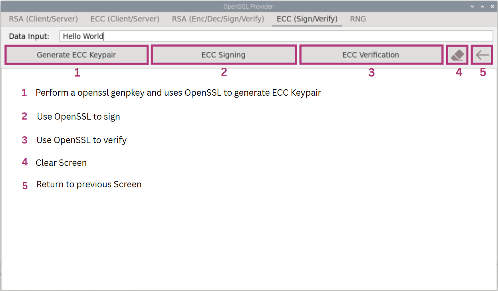 |
| ------------------------------------------------------------ |

Figure 14: ECC (Sign/Verify) Function Description


#### ECC Keypair Generation

To perform ECC functions, select "Generate ECC Keypair". ECC key is generated under storage hierarchy.

```shell
Setting up TPM...
Warning: generating random key material may take a long time
if the system has a poor entropy source
'openssl genpkey -provider tpm2 -algorithm EC -pkeyopt ec_paramgen_curve:P-384 -out ecc2.pem' executed 
'openssl pkey -provider tpm2 -provider default -in ecc2.pem -pubout -out ecc2.pub.pem' executed 
ecc2.pem contains: 
-----BEGIN TSS2 PRIVATE KEY-----
MIIBIAYGZ4EFCgEDoAMBAQECBEAAAAEEeAB2ACMACwAGAHIAAAAQABAABAAQADCg
Z2R37GOi0nB1npnlrHk7XapEI0W0HsgZtYTBS5/2nMFf3yFNxRwvAboT2mx4UvgA
......
-----END TSS2 PRIVATE KEY-----

++++++++++++++++++++++++++++++++++++++++++++
```

Expected Output (Partial): OpenSSL-Provider ECC (Sign/Verify) Generate ECC Keypair

#### ECC Signing and Verification

To sign, enter input in "Data Input" and select "ECC Signing" to sign.

```shell
Signing Data Input with Private Key...
'openssl dgst -sha256 -binary eccinput_data.txt > eccinput_data.hash' executed
openssl pkeyutl -provider tpm2 -provider default -inkey ecc2.pem -sign -rawin -in eccinput_data.hash -out mysig executed 
mysig contains: 
00000000: 3065 0231 00ec 44c3 f63f 31b9 bc6f 1996  0e.1..D..?1..o..
00000010: 918e f178 600d 8b6b 2181 10c7 4bdd fa78  ...x`..k!...K..x
00000020: cd7a ef2d 74a0 33ca 1d2c a45b 4bdc a7af  .z.-t.3..,.[K...
......
00000060: 4496 19bc 61b2 e8                        D...a..

++++++++++++++++++++++++++++++++++++++++++++

```

Expected Output (Partial): OpenSSL-Provider ECC (Sign/Verify) Signing with default input "Hello World"

To verify, ensure correct "Data Input" and select "ECC Verification".

```shell
Signature Verified Successfully
'openssl dgst -sha256 -binary eccinput_data.txt > eccinput_data.hash' executed 
'openssl pkeyutl -provider tpm2 -provider default -pubin -inkey ecc2.pub.pem -verify -rawin -in eccinput_data.hash -sigfile mysig' executed 
++++++++++++++++++++++++++++++++++++++++++++
```

Expected Output: OpenSSL-Provider ECC (Sign/Verify) Verify Success with default input "Hello World"

If "Data Input" is wrong, an error message "Verification Failure" will be displayed.

```shell
WARNING:esys:src/tss2-esys/api/Esys_VerifySignature.c:302:Esys_VerifySignature_Finish() Received TPM Error 
ERROR:esys:src/tss2-esys/api/Esys_VerifySignature.c:103:Esys_VerifySignature() Esys Finish ErrorCode (0x000002db) 
4090A0A27F000000:error:40000010:tpm2::verification failed::-1:731 tpm:parameter(2):the signature is not valid
Signature Verification Failure
'openssl dgst -sha256 -binary eccinput_data.txt > eccinput_data.hash' executed 
'openssl pkeyutl -provider tpm2 -provider default -pubin -inkey ecc2.pub.pem -verify -rawin -in eccinput_data.hash -sigfile mysig' executed 
++++++++++++++++++++++++++++++++++++++++++++
```

Expected Output: OpenSSL-Provider ECC (Sign/Verify) Verification Failure with input "123123"


## Random Number Generator

This section shows the use of OpenSSL libraries in generating a random hex or base64 value with indicated No. of bytes.

Select "RNG".

| 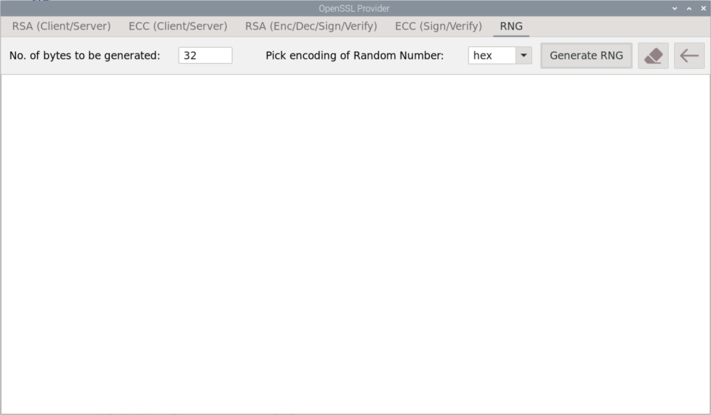 |
| ------------------------------------------------------------ |

Figure 15: OpenSSL-Provider RNG Screen

To change the bytes generated, enter the input in "No. of bytes to be generated". To change the encoding of the random number, select the arrow at "Pick encoding of Random Number" and select `hex` or `base64`. Select "Generate RNG" to generate random number.

In the following example, the numbers generated are 32 bytes in hex encoding and 64 bytes in base64 encoding.

```shell
ba6eb2fb3a24933b88d8293ac34547bb0a5ac0a3cf15487db2b9fd58b457507a

'openssl rand -provider tpm2 -provider default -hex 32' executed 
++++++++++++++++++++++++++++++++++++++++++++
RYiQqIsXdPcQD3PG71Cm5+x777Ky5u/aSkY4YvNNCzPe+3PT1IJ70C5Mqu3TX8aI
GEtOSRLZcIXlNxiiIGVh6Q==

'openssl rand -provider tpm2 -provider default -base64 64' executed 
++++++++++++++++++++++++++++++++++++++++++++
```

Expected Output: OpenSSL-Provider RNG Selection


## RSA (Client/Server) 

The RSA(Client/Server) is a demonstration of the hardening of the TLS session between a Client/Endpoint and Server/Cloud the OpenSSL S_Server and S_Client modules will be used along with the local host capability of Linux running on Raspberry Pi® 3B+/4.

TLS provides authenticated key exchange using asymmetric cryptography, data confidentiality using symmetric encryption and message integrity using message authentication codes scheme. However, these crypto primitives are stored in system memory and do not provide any trustworthiness assurance of the involved endpoint.

The drawback is that their implementation is using software library modules that store private keys in application or secure memory and have proven to contain bugs or vulnerabilities which have been exploited for the last several years. The benefit of using SLx 9670/72 TPM2.0 to protect the private key involved in the TLS handshake process.

### RSA (Client/Server) Function Description

RSA (Client/Server) Function

| 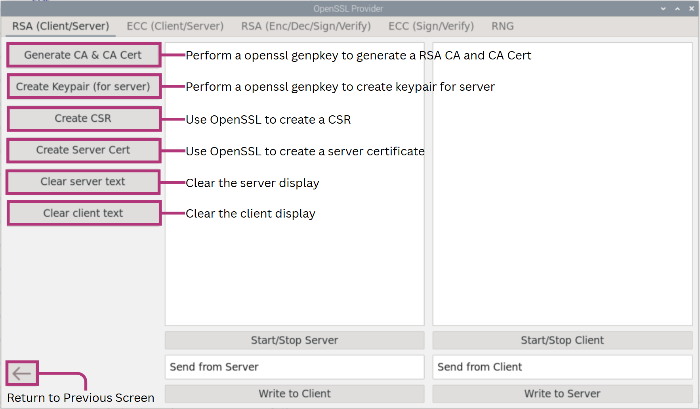 |
| ------------------------------------------------- |

Figure 16: RSA (Client/Server) Function Description


### Create Root CA and Its Certificate

At the core of the PKI there is the Root CA where the chain of trust originates. In normal practice you would use an established CA like for example GlobalSign.

For the purpose of this evaluation software we used OpenSSL to create a Root Certificate Authority. This is not advised for production purposes. Select "Generate CA & CA Cert".

```shell
Generating CA key-pair...
'openssl genpkey -algorithm RSA -out rsa_CA.pem'
++++++++++++++++++++++++++++++++++++++++++++
Creating Self-Signed Certificate:
openssl req -key rsa_CA.pem -new -x509 -days 7300 -sha256 -out CA_rsa_cert.pem -subj '/C=SG/ST=Singapore/L=Singapore/O=Infineon Technologies/OU=CSS/CN=TPMEvalKitCA'
++++++++++++++++++++++++++++++++++++++++++++
```

Expected Output: OpenSSL-Provider RSA (Client/Server) Generate CA & CA Cert


### Create Server Certificate

Generate Keypair for server by selecting "Create Keypair (for server)".

```shell
Generating SERVER key-pair...
'tpm2_createprimary -C o -P  -g sha256 -G rsa -c RSAprimary.ctx' executed 
'tpm2_evictcontrol -C o -c RSAprimary.ctx -P  0x8100000A' executed 
'openssl genpkey -provider tpm2 -algorithm RSA -pkeyopt parent:0x8100000A -out rsa_server_tss.pem'
++++++++++++++++++++++++++++++++++++++++++++
```

Expected Output: OpenSSL-Provider RSA (Client/Server) Create Keypair (for server)

Generate Certificate Signing Request for the Certificate Authority using server private key by selecting "Create CSR".

```shell
Creating Certificate Signing Request...
openssl req -new -provider base -provider tpm2 -provider default -key rsa_server_tss.pem -subj /CN=TPM_UI/O=Infineon/C=SG -out server_rsa.csr
++++++++++++++++++++++++++++++++++++++++++++
```

Expected Output: OpenSSL-Provider RSA (Client/Server) Create CSR

Generate Server Certificate from CSR and CA private key by selecting "Create Server Cert".

```shell
Creating Server Certificate...
openssl x509 -req -in server_rsa.csr -CA CA_rsa_cert.pem -CAkey rsa_CA.pem -out CAsigned_rsa_cert.crt -days 365 -sha256 -CAcreateserial 
++++++++++++++++++++++++++++++++++++++++++++
```

Expected Output: OpenSSL-Provider RSA (Client/Server) Create Server Cert


### Create an OpenSSL Server

We will now create an OpenSSL server. For this purpose, we are using the local host capabilities to run this example on the same Linux machine.

Create an openssl server instance using a terminal window session by selecting "Start/Stop Server.

```shell
openssl s_server -provider tpm2 -provider default -cert CAsigned_rsa_cert.crt -accept 4433  -key rsa_server_tss.pem 

Using default temp DH parameters
ACCEPT
```

Expected Output: OpenSSL-Provider RSA (Client/Server) Start Server


### Create an OpenSSL Client

We will create an OpenSSL Client and connect through a TLS session with OpenSSL Server (The two terminal windows and services running on the same Linux machine).

The OpenSSL Client will be run and the output of the connection is divided in two parts

a) The TLS handshake

b) TLS Cipher

As shown in Figure 17 the complete TLS handshake process was successful, and the encrypted channel established.

| 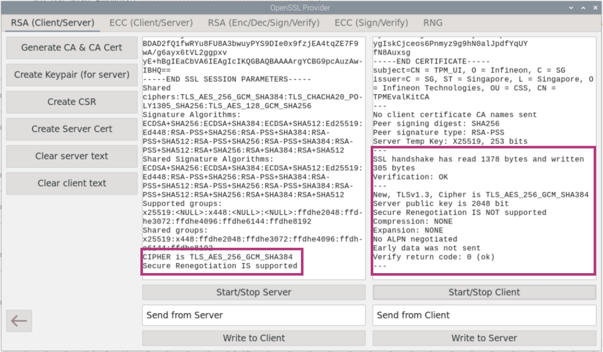 |
| ------------------------------------------------------------ |

Figure 17: OpenSSL-Provider RSA (Client/Server) Start Client Succeed


### Secure data exchange between Server and Client

Messages can be sent from Server to Client as well as Client to Server by entering input in the boxes below and selecting "Write to Server" or "Write to Client". The message "Hello from Client" and "Hello from Server" has been successfully sent in Figure 18.

|  |
| ------------------------------------------------------------ |

Figure 18: OpenSSL-Provider RSA (Client/Server) Communication

To stop connection, end the server by selecting "Start/Stop Server".


## ECC (Client/Server)

The ECC(Client/Server) is a demonstration to show the use of the TPM Key for secure communications.

Select "ECC (Client/Server)".


### ECC (Client/Server) Function Description

ECC (Client/Server) Function Description

| 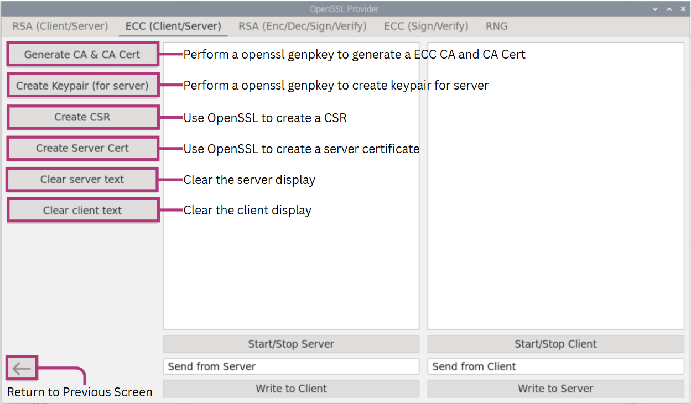 |
| ------------------------------------------------- |

Figure 19: ECC (Client/Server) Function Description


### Create Root CA and Its Certificate

At the core of the PKI there is the Root CA where the chain of trust originates. In normal practice you would use an established CA like for example GlobalSign.

For the purpose of this evaluation software we used OpenSSL to create a Root Certificate Authority. This is not advised for production purposes. Select "Generate CA & CA Cert".

```shell
Generating CA key-pair...
'openssl genpkey -algorithm EC -out ecc_CA_key.pem -pkeyopt ec_paramgen_curve:P-384'
++++++++++++++++++++++++++++++++++++++++++++
Creating Self-Signed Certificate:
openssl req -key ecc_CA_key.pem -new -x509 -days 7300 -sha256 -out CA_ecc_cert.pem -subj '/C=SG/ST=Singapore/L=Singapore/O=Infineon Technologies/OU=CSS/CN=TPMEvalKitCA'
++++++++++++++++++++++++++++++++++++++++++++
```

Expected Output: OpenSSL-Provider ECC (Client/Server) Generate CA & CA Cert


### Create Server Certificate

Generate Keypair for server by selecting "Create Keypair (for server)".

```shell
Generating SERVER key-pair...
'tpm2_createprimary -C o -P  -g sha256 -G ecc -c ECprimary.ctx' executed 
'tpm2_evictcontrol -C o -c ECprimary.ctx -P  0x8100000B' executed 
'openssl genpkey -provider tpm2 -algorithm EC -pkeyopt parent:0x8100000B -pkeyopt ec_paramgen_curve:P-384 -out ecc_server_tss.pem'
++++++++++++++++++++++++++++++++++++++++++++
```

Expected Output: OpenSSL-Provider ECC (Client/Server) Create Keypair (for server)

Generate Certificate Signing Request for CA using server private key by selecting "Create CSR".

```shell
Creating Certificate Signing Request...
openssl req -new -provider base -provider tpm2 -provider default -key ecc_server_tss.pem -subj /CN=TPM_UI/O=Infineon/C=SG -out server_ecc.csr
++++++++++++++++++++++++++++++++++++++++++++
```

Expected Output: OpenSSL-Provider ECC (Client/Server) Create CSR

Generate Server Certificate from CSR and CA private key by selecting "Create Server Cert".

```shell
Creating Server Certificate...
openssl x509 -req -in server_ecc.csr -CA CA_ecc_cert.pem -CAkey ecc_CA_key.pem -out CAsigned_ecc_cert.crt -days 365 -sha256 -CAcreateserial 
++++++++++++++++++++++++++++++++++++++++++++
```

Expected Output: OpenSSL-Provider ECC (Client/Server) Create Server Cert


### Create an OpenSSL Server

We will now create an OpenSSL server. For this purpose, we are using the local host capabilities to run this example on the same Linux machine.

Create an openssl S_Server instance using a terminal window session by selecting "Start/Stop Server".

```shell
openssl s_server -provider tpm2 -provider default -cert CAsigned_ecc_cert.crt -accept 4432  -key ecc_server_tss.pem 

Using default temp DH parameters
ACCEPT
```

Expected Output: OpenSSL-Provider ECC (Client/Server) Start Server


### Creating an OpenSSL Client

We will create an OpenSSL Client and connect through a TLS session with OpenSSL Server (The two terminal windows and services running on the same Linux machine).

The OpenSSL Client will be run and the output of the connection is divided in two parts

a) The TLS handshake

b) TLS Cipher

As shown in Figure 20 the complete TLS handshake process was successful, and the encrypted channel

| 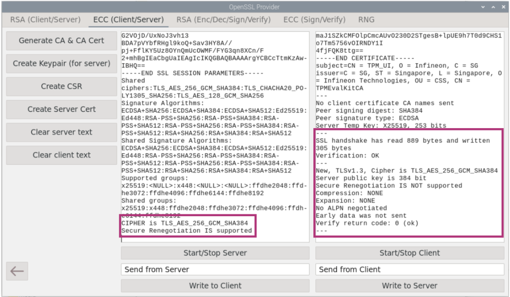 |
| ----------------------------------------------------------- |

Figure 20: OpenSSL-Provider ECC (Client/Server) Start Client


### Secure data exchange between Server and client

Messages can be sent from Server to Client as well as Client to Server by entering input in the boxes below and selecting "Write to Server" or "Write to Client". The message "Hello from Client" and "Hello from Server" has been successfully sent in Figure 21.

| 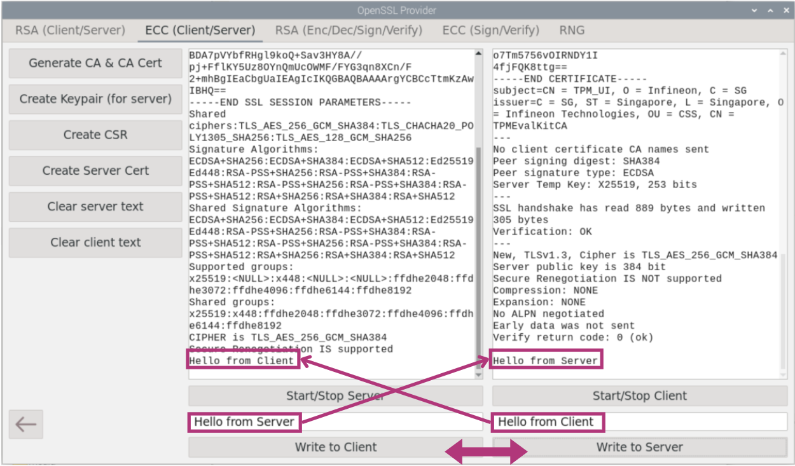 |
| ------------------------------------------------------------ |

Figure 21: OpenSSL-Provider ECC (Client/Server) Communication

To stop connection, end the server by selecting "Start/Stop Server".


# Data Sealing with Policy

This section shows you the Data Sealing with Policy in the OPTIGA™ TPM. It can be used to seal data using a PCR policy.

Sealing permits the key or secret to be protected not only by a password but by a policy. A typical policy locks the key to PCR values (the software state) current at the time of sealing. This assumes that the state at first boot is not compromised. Any preinstalled malware present at first boot would be measured into the PCRs, and thus the key would be sealed to a compromised software state.

## Data Sealing with Policy Function Description

Data Sealing with Policy Function Description

| 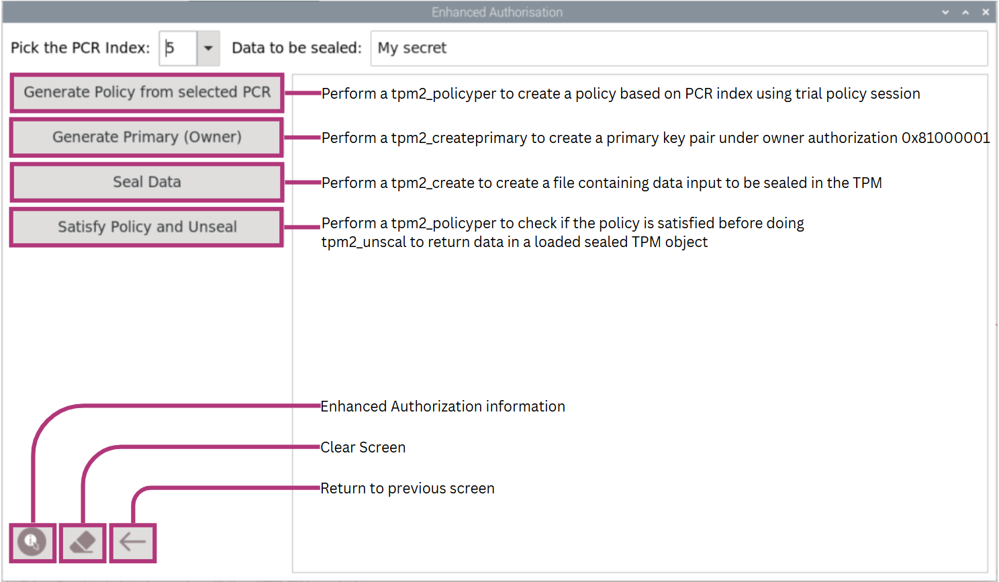 |
| ------------------------------------------------------------ |

Figure 22: Data Sealing with Policy Function Description


## Data Sealing with Policy Functions

Go back to the main screen and select "Data Sealing with Policy".


### Data Sealing with Policy

Select PCR Index and generate policy by selecting "Generate Policy from selected PCR". In this example, PCR Index "5" will be used. The policy will be tied down to PCR 5 and its predefined value.

```shell
Generating Policy... 
  sha256:
    5 : 0x0000000000000000000000000000000000000000000000000000000000000000
'tpm2_pcrread sha256:5 -o pcr.dat' executed 
'tpm2_startauthsession -S session.dat' executed 
eb0c0d560968473474c6eb736a90b951e178cb3c33b140e53ad68434bcd5ade0
'tpm2_policypcr -S session.dat -l sha256:5 -f pcr.dat -L policy.dat' executed 
'tpm2_flushcontext session.dat' executed 
++++++++++++++++++++++++++++++++++++++++++++
```

Expected Output: Data Sealing with Policy Generate Policy

Select "Generate Primary (Owner)" to generate primary key under storage hierarchy. A primary key will be created and the handle will be persisted under the storage hierarchy.

```shell
Creating Primary Key Pair... 
name-alg:
  value: sha256
  raw: 0xb
attributes:
  value: fixedtpm|fixedparent|sensitivedataorigin|userwithauth|restricted|decrypt
  raw: 0x30072
type:
  value: ecc
  raw: 0x23
......
tpm2_evictcontrol -C o -P  -c 0x81000001 
'tpm2_createprimary -C o -P  -g sha256 -G ecc -c primary.ctx' executed 
'tpm2_evictcontrol -a o -c primary.ctx -P  0x81000001' executed 
++++++++++++++++++++++++++++++++++++++++++++
```

Expected Output (Partial): Data Sealing with Policy Generate Primary (Owner)

Enter an input in "Data to be sealed". Then select "Seal Data" to seal the input.

```shell
Sealing data_to_be_sealed.txt...
name-alg:
  value: sha256
  raw: 0xb
attributes:
  value: fixedtpm|fixedparent
  raw: 0x12
type:
  value: keyedhash
  raw: 0x8
algorithm: 
  value: null
  raw: 0x10
keyedhash: 176aa2078ad25273da82b05f862d74400c6199ec5f5d58991d18b9d34b1791bc
authorization policy: eb0c0d560968473474c6eb736a90b951e178cb3c33b140e53ad68434bcd5ade0
'tpm2_create -C 0x81000001 -g sha256 -u key.pub -r key.priv -L policy.dat -i data_to_be_sealed.txt' executed 
++++++++++++++++++++++++++++++++++++++++++++
```

Expected Output: Data Sealing with Policy Seal Data

To unseal data, ensure that the PCR Index is correct and select "Satisfy Policy and Unseal".

```shell
Checking if the PCR index satisfies the policy... 
'tpm2_load -C 0x81000001 -u key.pub -r key.priv -n unseal.key.name -c unseal.key.ctx' executed 
'tpm2_startauthsession -S session.dat' executed 
eb0c0d560968473474c6eb736a90b951e178cb3c33b140e53ad68434bcd5ade0
'tpm2_policypcr -S session.dat -l sha256:5 -f pcr.dat -L policy.dat' executed 
++++++++++++++++++++++++++++++++++++++++++++
'tpm2_unseal -psession:session.dat -c unseal.key.ctx -o unsealed_data' executed 
'tpm2_flushcontext session.dat' executed 
My secret
++++++++++++++++++++++++++++++++++++++++++++
```

Expected Output: Data Sealing with Policy Satisfy Policy and Unseal Success

If PCR index is wrong, policy check will fail as the predefined PCR index is 5.

```shell
Checking if the PCR index satisfies the policy... 
'tpm2_load -C 0x81000001 -u key.pub -r key.priv -n unseal.key.name -c unseal.key.ctx' executed 
'tpm2_startauthsession -S session.dat' executed 
8494cc6df746b891d976272935cf72aaa19bfbb447c380cb82fb7662992d4fff
'tpm2_policypcr -S session.dat -l sha256:2 -f pcr.dat -L policy.dat' executed 
++++++++++++++++++++++++++++++++++++++++++++
WARNING:esys:src/tss2-esys/api/Esys_Unseal.c:295:Esys_Unseal_Finish() Received TPM Error 
ERROR:esys:src/tss2-esys/api/Esys_Unseal.c:98:Esys_Unseal() Esys Finish ErrorCode (0x0000099d) 
ERROR: Esys_Unseal(0x99D) - tpm:session(1):a policy check failed
ERROR: Unable to run tpm2_unseal
'tpm2_unseal -psession:session.dat -c unseal.key.ctx -o unsealed_data' executed 
'tpm2_flushcontext session.dat' executed 
```

Expected Output: Data Sealing with Policy Satisfy Policy and Unseal Failure with wrong PCR index

If PCR index is correct but value is wrong, error messages will be displayed to indicate failure as the predefined value of PCR index 5 is all '0x0000000000000000000000000000000000000000000000000000000000000000'. First, we head go to Setup and Basic Features under PCR to extend PCR index 5. Refer to Section 2.2.3 for information on extend PCR.

```shell
Input= 123456789abcdef0000000000000000000000000000000000000000000000000
'tpm2_pcrextend' executed 
++++++++++++++++++++++++++++++++++++++++++++
  sha1:
  sha256:
    5 : 0x846E1670334EC4CF3AC4A5B33931EB7ECDF064DF0A167D1D4BB139FFE7976B42
  sha384:
'tpm2_pcrread sha1:5+sha256:5+sha384:5' executed
++++++++++++++++++++++++++++++++++++++++++++
```

Expected Output: Extending PCR Index 5 with Setup and Basic Features PCR

If PCR index is correct but value is wrong, an error message that the PCR value is wrong will be shown and the policy check will fail. TPM2_unseal will not be successful.

```shell
Checking if the PCR index satisfies the policy... 
'tpm2_load -C 0x81000001 -u key.pub -r key.priv -n unseal.key.name -c unseal.key.ctx' executed 
'tpm2_startauthsession -S session.dat' executed 
WARNING:esys:src/tss2-esys/api/Esys_PolicyPCR.c:288:Esys_PolicyPCR_Finish() Received TPM Error 
ERROR:esys:src/tss2-esys/api/Esys_PolicyPCR.c:100:Esys_PolicyPCR() Esys Finish ErrorCode (0x000001c4) 
ERROR: Esys_PolicyPCR(0x1C4) - tpm:parameter(1):value is out of range or is not correct for the context
ERROR: Could not build pcr policy
ERROR: Unable to run tpm2_policypcr
'tpm2_policypcr -S session.dat -l sha256:5 -f pcr.dat -L policy.dat' executed 
++++++++++++++++++++++++++++++++++++++++++++
WARNING:esys:src/tss2-esys/api/Esys_Unseal.c:295:Esys_Unseal_Finish() Received TPM Error 
ERROR:esys:src/tss2-esys/api/Esys_Unseal.c:98:Esys_Unseal() Esys Finish ErrorCode (0x0000099d) 
ERROR: Esys_Unseal(0x99D) - tpm:session(1):a policy check failed
ERROR: Unable to run tpm2_unseal
'tpm2_unseal -psession:session.dat -c unseal.key.ctx -o unsealed_data' executed 
'tpm2_flushcontext session.dat' executed 
```

Expected Output: Data Sealing with Policy Satisfy Policy and Unseal with right PCR index and wrong index value


# Attestation

This section shows you how to use Attestation in the OPTIGA™ TPM. A system health check supported by Infineon's OPTIGA™ TPM lets users check that their devices have not been manipulated. The TPM provides a secured identity and storage space for system control mechanisms that may check whether hardware and software are still running as intended. The system notifies the user if it does detect changes, e.g. caused by malware.

Go back to the main screen and select "Attestation".


## Attestation Function Description

A TPM attestation offers cryptographic proof of software state. The attestation is a TPM quote: a number of PCR are hashed, and that hash is signed by a TPM key known as attestation key. If the remote party can validate that the signing key came from an authentic TPM, it can be assured that the PCR digest report has not been altered. The device remote attestation supported by Infineon's OPTIGA™ TPM lets users check that their devices have not been manipulated to establish the trust in the devices.

| 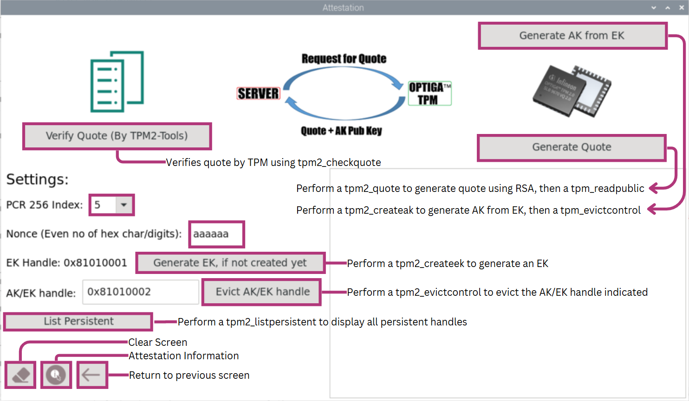 |
| ---------------------------------------------------------- |

Figure 23: Attestation Function Description


## Generating Quote

To generate a signing key, AK will be required. An AK can be generated from an EK. If an EK has not been generated, select the button “Generate EK, if applicable” to generate an endorsement key using RSA. 

EK will be successfully generated.

```shell
'tpm2_createek -P  -w  -c 0x81010001 -G rsa -u ek.pub' executed 
++++++++++++++++++++++++++++++++++++++++++++
```

Expected Output: EK Generated

Input preferred AK/EK handle used to generate AK from EK. The default handle is 0x81010002. Then, select “Generate AK from EK” to generate Attestation Keypair from the Endorsement Key. AK will be successfully generated.

```shell
Generating Attestation Key Pair... 
persistent-handle: 0x81010002
action: persisted

'tpm2_createak -P  -C 0x81010001 -G rsa -u ak_pub.bin -n ak.name -c ak.ctx' executed 
'tpm2_evictcontrol -C o -P  -c ak.ctx 0x81010002 executed 
++++++++++++++++++++++++++++++++++++++++++++
```

Expected Output: AK Generated

Configure the "PCR 256 Index" to the index you wish to perform the signing. In this example, we will use PCR Index 5.

Next, Select the button "Generate Quote". The PCR is signed by TPM attestation key. The Nonce used in this specific example to generate quote will be "9e0c6f", an even number of hexadecimal symbols and will be converted into a byte array, but in real life application, the nonce will be a random or pseudo-random number issued in an authentication protocol to ensure that old communications cannot be reused in replay attacks.

```shell
Generating Quote of the PCR Index... 
quoted: ff54434780180022000b1faed860a241c94160ea6c825c1826e3836d058ff57ac2efb90586c7032833030003aaaaaa00000000000d05d9000000000000000001000f001500402e0000000001000b032000000020091b233b8f69f815889e0899f5688014b90e296fbee2bc66075c494489f3ea17
signature:
  alg: rsassa
  sig: 42a77d7f328bdcd593a15d7d36eb961ca6b2b470bfc7c513dae0a882b09a925d5787d08c0a8d545b6fa......
'tpm2_quote -c 0x81010002 -g sha256 -l sha256:5 -m tpmquote.data -q aaaaaa -f plain -s quote_sign_data' executed 
++++++++++++++++++++++++++++++++++++++++++++
name: 000bf5cd1c1b6740db3500fcb1aaf7b2dc7dad95c9f07452149772a26e7e88f1dbfd
qualified name: 000b1faed860a241c94160ea6c825c1826e3836d058ff57ac2efb90586c703283303
name-alg:
  value: sha256
  raw: 0xb
attributes:
  value: fixedtpm|fixedparent|sensitivedataorigin|userwithauth|restricted|sign
  raw: 0x50072
type:
  value: rsa
  raw: 0x1
......

'tpm2_readpublic -c 0x81010002 -f pem -o ak_pub.pem' executed 
++++++++++++++++++++++++++++++++++++++++++++
```

Expected Output (Partial): Attestation Generate Quote


## Verifying Quote

To verify quote using OpenSSL, select "Verify Quote (OpenSSL)". A "Verified OK" message will be displayed upon success. To verify quote using TPM2 Tools, select "Verify Quote (TPM)". A command tpm2_checkquote will be issued to check for discrepancies from the generation of quote and no error messages will be displayed if successful. RSA Signature will be checked during verification.

```shell
sig: 42a77d7f328bdcd593a15d7d36eb961ca6b2b470bfc7c513dae0a882b09a925d5787d08c0a8d545b6fa6753a9d0c3c1918a155a88b1f1b94435971ca93e3293f35cbd5b3673aed65d256358dc1ee51ef7c35aee0c6cf34d2055ba60f31094b457d8ed22528b11e2d1d6229bfddf62db99ea9675d4d4b5f7f8e3324edd9a86490c404d6b73cfc0845ac826f55a22c70d987da3b76707e237ddb16eca1441fa0f6fb779de46a926d7cb7c8b8c5bec66c6a0cdfc80a6357ee2248e2d1472f02129565838a1d0a5e1a1644307cd745f1975628f621750a3b298b19ea0b7e472cc23564e722670659984f6674eed95fa826983b62ff7f30d0ef105b4f096a8711ec0a
'tpm2_checkquote -c ak_pub.pem -m tpmquote.data -s quote_sign_data -G sha256 -q aaaaaa' executed 
Verification Successful Unless Error Message Is Shown
++++++++++++++++++++++++++++++++++++++++++++
```

Expected Output: Attestation Verify Quote with OpenSSL and TPM2 Tools Success with Nonce "9e0c6f"

For the Attestation verification for Quote of (TPM), in this example of the TPM Explorer, the "Nonce" is changed to be "aaaaaabb". If the server uses a difference "Nonce" than the one used during quote generation "9e0c6f", error messages will be displayed to indicate failure.

```shell
sig: 42a77d7f328bdcd593a15d7d36eb961ca6b2b470bfc7c513dae0a882b09a925d5787d08c0a8d545b6fa6753a9d0c3c1918a155a88b1f1b94435971ca93e3293f35cbd5b3673aed65d256358dc1ee51ef7c35aee0c6cf34d2055ba60f31094b457d8ed22528b11e2d1d6229bfddf62db99ea9675d4d4b5f7f8e3324edd9a86490c404d6b73cfc0845ac826f55a22c70d987da3b76707e237ddb16eca1441fa0f6fb779de46a926d7cb7c8b8c5bec66c6a0cdfc80a6357ee2248e2d1472f02129565838a1d0a5e1a1644307cd745f1975628f621750a3b298b19ea0b7e472cc23564e722670659984f6674eed95fa826983b62ff7f30d0ef105b4f096a8711ec0a
ERROR: Error validating nonce from quote
ERROR: Verify signature failed!
ERROR: Unable to run tpm2_checkquote
'tpm2_checkquote -c ak_pub.pem -m tpmquote.data -s quote_sign_data -G sha256 -q aaaaaabb' executed 
Verification Successful Unless Error Message Is Shown
++++++++++++++++++++++++++++++++++++++++++++
```

Expected Output: Attestation Verify Quote TPM Failure with Nonce aaaaaabb"


## Evict AK/EK Handle

If you need to evict AK/EK Handle in order to make space for more persistent handles, input the handle to evict correctly and select "Evict AK/EK handle". In this example, we use 0x81010002 as the input persistent handle.

```shell
persistent-handle: 0x81010002
action: evicted
'tpm2_evictcontrol -C o -c 0x81010002 -P ' executed 
++++++++++++++++++++++++++++++++++++++++++++
```

Example Output: Evicting AK/EK handle 0x81010002 Success


# References

1.  https://downloads.raspberrypi.org/raspios_full_arm64/images/raspios_full_arm64-2025-05-13/
2.  <https://www.infineon.com/cms/en/product/evaluation-boards/iridium9670-tpm2.0-linux/>
3.  <http://www.infineon.com/tpm>
4.  https://trustedcomputinggroup.org/resource/tpm-main-specification/
5. <https://www.infineon.com/cms/en/product/evaluation-boards/optiga-tpm-9672-rpi-eval/>
6. <https://www.infineon.com/cms/en/product/evaluation-boards/optiga-tpm-9673-rpi-eval/>


